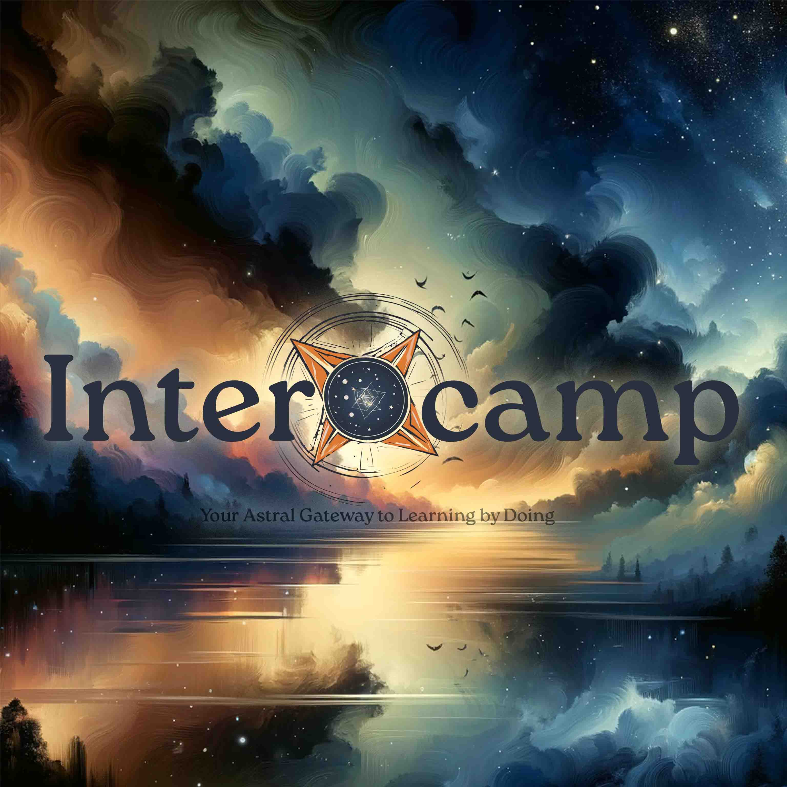

### Overview: *Inter*~~nship~~ + ~~boot~~*camp*
> Your Astral Gateway to Learning by Doing; Coworking + Communities

Intercamp is a novel (social media & coworking) ecosystem connecting learners and professionals with real-world opportunities, enabling communities to volunteer for initiatives while earning equity, experience, and fraternity. It serves as an asynchronous alternative to traditional internships, hackathons, and research programs. It aims to provide top-notch collaborative environments for coworking with aligned communities - an operating system for any network state.
##### Core Value Propositions
- Community-driven platform for learners & doers to earn proof of experience while building potential equity (i.e. notional contributions log for future monetization share) 
- Structured, asynchronous alternative to internships, hackathons, and side projects for continuous experiential upskilling within a part-time commitment 
- Platform for initiatives & projects to organize bounties, track progress, and collaborate beyond boundaries
- Virtualized Practice School integrations bridging academia and industry
- An affiliate network of coworking, incubators and makerspaces within academic & business districts

### Market Context

##### Problem Space
1. **Skills-Experience Gap**
    - Conventional education lags behind rapidly evolving technology & industry needs
    - Limited access to meaningful real-world experiences like internship, apprenticeship
    - Difficulty in initiating and sustaining motivation for side projects for upskilling
    - With degree inflation, majority of Indian graduates are unemployable or ill-equipped for work 
2. **Industry Challenges**
    - Companies struggle with talent assessment and benchmarking
    - Heavy investment required in internal training
    - Inefficient project staffing and resource utilization
    - Limited mechanisms for part-time professional engagement
3. **R&D Ecosystem**
    - Slow progress in university research and development
    - Limited student participation & cross-institution collaboration
    - Untapped potential in academic-industry partnerships

##### Market Trends
- India needs to create 100 million 'jobs' in the next decade
- Growing demand for proof-of-work credentials and  portfolio-based hiring
- Emergence of continuous learning models & community-driven platforms 
- Rise of project-based, remote, fractional work & the gig economy
- Shift towards practical, experience-based learning / co-op programs: 
  ISB -> BITSOM -> Masters Union -> GrowthX -> Intercamp
- Increasing volunteering capacity, capabilities and self-sustaining incubation: from FOSS, DPI (e.g., organizations like People+AI) to Interchain, DAO, etc. 

---
### Mission & Vision

##### Mission
- Nurture the learning institutions and talent pipelines of the future.
- Build an effective & efficient alternative to internships, bootcamps or hackathons for the masses. Making Learning by Doing & Coworking with Communities as frictionless as surfing Instagram, LinkedIn, etc. (Excessive social media screen time is also a competitor, alongside stale theoretical educational models.) 
- Incubate the Intercamp ecosystem of upstarts & initiatives across domains like university research (ResearchCamp), open practicums (Anvi Kriti Fellowships), proof of experience, government schemes facilitation, industry exposure, etc. 

##### Vision
- Building toward a distributed network of interdisciplinary learning villages that blend academics, experiential learning, entrepreneurship, and community living. Initially starting with just a digital platform and self-seeded projects, evolving toward an ecosystem where participants can organically propose, find, and join projects aligned with their interests. Eventually physically chartering with co-working and maker-spaces to transform how learning, working, and value creation intersect. **Your Astral Gateway to Coworking+Communities.**

##### Guiding Principles
- **Learn by Doing**: Hands-on projects, internships, and entrepreneurial ventures supplement theory-based learning
- **Community over Classrooms**: Learning transcends classrooms, driven by a distributed network of peers, mentors, companies, and opportunities
- **Incentive Alignment**: Value generation for all stakeholders, with certification or notional equity rewards for contributors
- **Agency & Modularity**: Learners & Doers should be able to forge their own unique paths tailored to their interests & goals
- **Bootstrapping & Dogfooding**: Build what you will use, use what you are building. Be as lean as possible.
- **Fast Feedback Iteration**: Validate minimal viability as quickly as possible and course correct with rapid iterations & feedbacks.

##### Experience Transformations
- **Learning**: Traditional Classes → Learning by Doing
- **Experience**: One-off Internships → Continuous Project Experience
- **Projects**: Solo Side Projects → Collaborative Value Building
- **Portfolio**: Static Resumes → Dynamic Proof of Work
- **Community**: Campus Boundaries → Borderless Communities

##### Value Creation Loops
- **Individual**: Portfolio → Experience → Opportunities
- **Project**: Ideas → Bounties → Validated Solutions
- **Community**: Skills → Networks → Collective Capital
- **Ecosystem**: Talent → Innovation → Impact

---
### Solution Architecture
Intercamp sits at the intersection of: 
1. **Talent** (students, professionals, freelancers, founders, etc.)
2. **Initiatives** (projects, fellowships, research programs, events, etc.)
3. **Institutions** (universities, corporations, startups, NGOs, etc.)
 

> [!NOTE] Starts with Github MVP, evolves till Samatvartha Interchain 
> It starts with a GitHub Based MVP with incremental, composable progress towards the roadmap alongside appropriate distribution/leads wins. It might (or might not) evolve into various instances of 'Intercamp Wormholes' for various tracks like ResearchCamp, FreelanceCamp, FranchiseCamp, etc.   

The core components of the solution includes:
##### Digital (Public) Infrastructure
- Project marketplace with Quest & Bounty management systems
- Progress tracking and verification, Reward management
- Community building, peer-discovery, team/crew formation
- Talent discovery, etc.

##### Physical (Chartered) Infrastructure #e
- Community avenues & temporary charters
	- Events, meetups and conventions, etc.
- Affiliated or managed services near academic and business hubs
	- Co-working spaces, maker labs, incubators & accelerators
	- Research facilities, workshops, scientific laboratories, etc.
	- Seats & Spaces, Virtual Address, Managed Amenities, SM-REIT ...

##### Practice Schools & Research Collaboration Integrations #e
- **Academic Integration**
	- Virtualized Practice School Programs
	- Research Collaboration Tools
	- Cross-institution Projects
- **Industry Partnership**
	- Corporate Program Integration
	- R&D Collaboration Framework
	- Talent Pipeline Solutions
- **FELLOWSHIP Programs**
	- Co-op Programs
	- Research Opportunities
	- Government Partnerships

##### Primitives & Social Constructs
- **Clans**: Nested communities based on skills, affinities & networks
	- Self-organized talent/individual supply into aligned groups
	- Resource sharing, mentorship & peer learning
	- Enables crew formation for fractional teams outsourcing as well 
- **HACKSHIP** #e
	- 6-8 week cohorts with structured programs/outcomes
	- Community events (hackathons, retreats, trade shows, etc.) 
	- Inter-guild/chapter collaborations avenue #e
- **FELLOWSHIP** #e
	- Co-op programs, learning pathways or sponsored roles with specific goals
	- Industry or government partnerships, open schooling & research
	- Research, impact or learning opportunities
- **GUILD** #e
	- Physical spaces to charter clans, chapters and grant citizenships
	- Event hosting, co-working, maker spaces, etc.
	- Network institutionalization

##### Project Organization
- **Project Tracks**
	- (Innovation & Research) - Research & Development; Open Knowledge; Moonshots; Micro Experiments
	- (Business & Impact) - Impact Collective; Commercial Collective; Portfolio Syndicate; Think Tank
	- (Learning & Community) - Experiential Learning; Ecosystem Incubation
- **AdVentures**
	- Long-term programs/initiatives with clear mission, impact
	- Contribution equity distribution framework, if needed
	- Resource allocation model, Impact measurement
- **Quests**
	- Defined projects with clear scope
	- Resource requirements for specified Roles
	- Value attribution, Timeline management
- **Bounties**
	    - Specific tasks with clear requirements
	    - Crew formation, Reward structure, Verification & Quality Control

> [!WARNING] #e means TBD
> If Company = Clan, Adventure and Guild that are related to a single legal entity? This way we can allow private collaboration to happen using same platform constructs. #e

> [!NOTE] Proposed Hierarchy In a Nutshell
> - Individuals (Talent & Communities)
> 	- Clans
> 		- Tribe 
> 			- (Party/Crew)
> 				- Hunter (Resource/Member/User)
> - Initiatives (Programs & Campaigns)
> 	- Adventure
> 		- Quest - (x Fellowship, x Hackship)
> 			- Bounties
> 				- (Tasks/Milestones/Checkpoints)
> - Institutions (Organizations & Companies)
> 	- Guilds - Charter Physical Virtual Hybrid Remote
> 		- Chapters / Pillar / Division?? 
> 			- Function 
> 				- Role (Citizen/Contributor/Address/Seat ID) - OKR, Goals
> - Fellowships, Hackships, Company, Network State etc.

---
### GTM & Distribution Strategy

{{ Below is a rudimentary draft }} #e
##### Distribution Strategy
1. **B2C**
    - Students seeking internship experience
    - Professionals pursuing side-projects
    - Explorers looking to startup or volunteer
2. **B2B2C**
    - University placement & research ecosystems
    - Campus fraternities
    - Corporate CSR
    - Influencer communities
    - Social clubs
3. **B2B**
    - Private sector placement funnel
    - University learning & co-op solutions (Virtualized Practice School)
    - Government scheme facilitation

##### Growth Strategy
- **Phase 1: MVP Launch**
	- Core digital platform development
	- 2-3 university partnerships
	- 20-50 initial contributors
	- Initial project seeding through 2014P_Samatvartha_Thesisbox
- **Phase 2: Community Building**
	- Scale to 500+ active users
	- Expand university R&D partnerships
	- Define specialized research tracks
	- Enable cross-institution collaboration
	- Iterate based on feedback
- **Phase 3: Expansion**
	- Onboard Institutional Partners
	- Enhanced enterprise & interchain DPI solutions
	- Growth hack Individual Contributors
	- Physical spaces implementation

##### Revenue Streams (KYRM RevKit) 
- Affiliate Commissions (Advertising), Donations (Sponsorships), Managed Franchising (Integrations)
- TBD DAO / Tokenomics Angle post KYRM milestones

---

# Appendix

##### Intercamp In A Nutshell:
- Your Astral Gateway to Coworking + Communities 
	- Projects, Bounties & Talent Discovery Platform
	- Community Networks, Collaborative Spaces & Events
- + Learning by Doing
	- Asynchronous alternative to internships & bootcamps; Think YC + ACM + Github + Fiverr
	- Virtualized Practice Schools & Research Collaboration
	- Integrations for University and/or Industry...
- + Social ~~Media Platform~~ Hobbies Playground
	- Competing against social media / screen time - from Instagram, Reddit, LinkedIn of the world to the Netflix, YouTube, BGMI, etc.
- + Enabling AI-driven Conway Refactoring of Labour Markets & Organizations
> intercamp.in ; ~~(.org is available at 1.2 Lakh)~~

Step into Intercamp, your **Astral Gateway** where **Coworking + Communities** power **Learning by Doing**. Our platform offers a minimal, yet powerful, digital space for individuals to actively build their skills and portfolio by tackling real-world quests (projects) and bounties (tasks). Forget traditional, often rigid, learning paths; Intercamp provides an asynchronous alternative to internships and bootcamps, emphasizing hands-on experience that directly translates into tangible "proof of work." While we kickstart the ecosystem by seeding initial projects across vital tracks like open-source, R&D, and outsourcing, the platform is built to empower anyone – from university departments to industry labs and community initiatives – to easily host and manage their own collaborative work. This makes Intercamp a versatile "plug-and-play" solution, serving as a virtual practice school for students, a source of flexible apprenticeships for companies, and a self-sustaining ecosystem for talent to gain equity, experience, and progress through diverse project types. Our vision extends to offline co-working and makerspaces, creating blended environments that bridge academia and industry and facilitate deep, hands-on collaboration. As the demand for practical, flexible learning soars, Intercamp is ready to play a crucial role in shaping future talent and driving innovation forward.

---