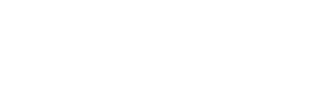

# Anvi Kriti: Open Pathways to Real-World Readiness  
(Adventure Memo - 2014P_Samatvartha Thesisbox / Education & Enterprising Primitive)

**TLDR:** Anvi Kriti challenges India's rote-learning & high-stakes exam culture by building an ecosystem for open, experiential, and alternative education. We enable NIOS/IGNOU-compatible modular learning pathways, integrated "Learning by Doing" practicums (via Intercamp & 2014P_), and AI-native tools, empowering learners to gain recognized credentials alongside real-world skills and enterprising experience. This is about making education relevant, flexible, and deeply connected to life and livelihood, moving beyond the limitations of conventional K-12 and a one-size-fits-all college system. We make this happen by empowering individuals - like homemakers - and organizations - like entrance exam coaching centers - with technological commons and federated franchising to operate local micro-schooling/unschooling pods, while bridging them with unbundled peer learning & shared social avenues.

### 1. The Indian Education Paradox: Credentials vs. Capability

India's current education landscape – K-12, higher education, competitive exam prep – is a pressure cooker with misaligned incentives:

- **The Coaching Culture & Exam Trap:**  Immense resources are poured into high-stakes, low-success-rate exams (UPSC, JEE, NEET), often sacrificing holistic development and practical skills year after year!
    
- **Subpar K-12 & Irrelevant College Curricula:**
    
    - Formal schooling mostly prioritizes rote curriculum completion over genuine learning outcomes (a systemic issue exacerbated by aspects of the RTE Act).
        
    - Outdated syllabi and a lack of focus on life skills, critical thinking, and vocational readiness leave majority of graduates unemployable.
        
- **One-Size-Fits-All Model:** Fails to cater to diverse learning styles, paces, and aspirations. This industrial era compliance model of schooling stifles curiosity and creativity.
    
- **Pervasive Skills-Experience Gap:** A significant disconnect exists between what formal education provides and what the real world (industry, entrepreneurship, life itself) demands. "Degree inflation" masks this capability gap.
    
- **The Unschooling/Homeschooling Dilemma:** While offering an alternative, these paths often lack structured support and a broader ecosystem to easily leverage recognized open education pathways, making them an elite or inaccessible pursuit. Understand this perspective better at https://bit.ly/UnK12India
    

### 2. AnviKriti's Vision: Liberating Learning – From Rote to Relevance, From Theory to Action.

Anvi Kriti (Anvi: Knowledge/Exploration + Kriti: Action/Creation) is architecting a thriving ecosystem for **Open, Alternative, and Experiential Education Pathways.** We envision a future where:

- Learning is **personalized** (pace, content, pedagogy), modular, and intrinsically linked to practical application and **evidence-based learning** principles.
    
- Recognized credentials are an outcome of flexible, learner-centric journeys, not the sole focus.
    
- The "wasted years" of pure exam prep become fertile ground for genuine skill-building, portfolio development, and **holistic education**.
    
- India's demographic dividend is empowered to become enterprising job creators, not just job seekers, driven by demonstrable skills and entrepreneurial spirit, moving us beyond a purely credential-obsessed model to one that values real-world experience.
    

### 3. The AnviKriti Ecosystem: Key Pillars & Offerings

Anvi Kriti provides enabling infrastructure, curated pathways, and a supportive community:

- **A. Modular, Open Credentialing Roadmaps (NIOS/IGNOU & Beyond):**- **oadmaps (NIOS/IGNOU & Beyond):**
    
    - **Core:** Structured yet flexible learning pathways aligned with recognized open schooling boards like NIOS (K-12: 3rd, 5th, 8th, 10th, 12th) and IGNOU (higher ed degrees/diplomas).
        
    - **Learner Agency:** Self-paced progression, module selection aligned with individual goals. A clear, viable alternative to conventional schooling.
        
- **B. - **Customized, Experiential Curriculum & Specialized Practicums:**
    
    - **Unbundling Education:** Between formal credentialing checkpoints, learners engage in:
        
        - **Modular Learning Design:** Curated/self-designed modules on specific skills, Indic Knowledge Systems (IKS), vocational training, or passion projects.
            
        - **Specialized Practicums (Deep Intercamp Synergy):** Learners apply knowledge via real-world projects, bounties, and AdVentures on Intercamp.
            
            - **Examples:** "PMEGP Fellow" (mastering government schemes via hands-on micro-entrepreneurship), "AIF Fellow" (contributing to Agriculture Infrastructure Fund projects), "NIOS Project Fellow" (fulfilling NIOS project needs via tangible Intercamp work).
                
            - This "Learning by Doing" builds a robust portfolio and irrefutable proof-of-experience.
                
- **C. Alternative Exam Preparation Pathways (Skill-Infused & Sanity-Preserving):**
    
    - **The Anvi Kriti Method for Coaching Centers:** Instead of pure rote memorization for exams like UPSC, JEE, etc., Anvi Kriti enables associated coaching centers with pedagogy and tools where exam prep is integrated with skill development and practical projects.
        
    - **How** Core syllabus coverage is augmented with relevant Intercamp quests like from DespiteTheRepublic AdVenture for UPSC, various STEM quests across AdVentures for for JEE, etc. It can also empower drop-year into a holistic learning avenue for evidence-backed understanding.
        
    - **Dual Benefit:** Prepares for the exam while simultaneously equipping learners with valuable, transferable skills and a portfolio, making them more resilient regardless of exam outcomes.
        
- **D. AI-Native Learning Management & Gamified Support Tools:**
    
    - Personalized learning path recommendations & **digital nativeness**.
        
    - Curriculum mapping, progress tracking, evidence-based assessment tools.
        
    - Optional gamified UI/UX (think "League of Learners", "LearnCraft", "Schedule Learn", etc.) to enhance engagement.
        
    - AI Tutors backing for navigating open curricula; facilitation of peer learning & mentorship.
        
- **E. Ecosystem Enabler for Micro-Schools & Unschooling Pods (The Federated Franchise Model):**

	- **Core GTM:** Provide resources, frameworks, DPI, and credentialing backbones to **empower local entrepreneurs – especially homemakers, existing tuition/coaching centers, and community leaders** – to establish and operate micro-schools or unschooling pods.
	    
	- Connect these local "AnviKriti Hubs" into a larger, supportive federated network sharing wisdom, operational best practices, and leveraging common technological infrastructure. Enable easy partnerships and integrations with existing extra-curricular and after-school ecosystem for shared physical infrastructure and social learning.
        

### 4. How AnviKriti Creates Value & Synergies:

- **For Learners:**
    
    - Personalized, flexible, engaging, self-paced learning paths.
        
    - Recognized credentials (NIOS/IGNOU) combined with valuable real-world skills and a "proof-of-experience" portfolio (via Intercamp).
        
    - A more holistic and less stressful approach to competitive exam preparation.
        
    - Clearer pathways to practical application of knowledge, including entrepreneurship and meaningful livelihoods.
        
- **For Parents:**
    
    - A viable, structured, high-quality and credentialed alternative to conventional schooling or pure exam-coaching factories.
        
    - Assurance of skill development alongside academic progression for future-readiness with baked in risk-hedging.
        
- **For Micro-School/Pod Operators (Homemakers, Coaching Centers, Local Educators):**
    
    - **Lowered Barrier to Entry:** Access to curriculum frameworks, operational playbooks, credentialing pathways, and tech tools.
        
    - **Better Unit Economics:** Leverage shared infrastructure; potential to tap into existing after-school market value chains.
        
    - **Enhanced Value Proposition:** Offer recognized open schooling credentials and cutting-edge experiential learning, differentiating from traditional tuition.
        
    - **Community & Support:** Become part of a larger network for shared learning and resources.
        
    - **New Livelihood Opportunities:** Enables passionate educators and homemakers to become educational entrepreneurs.
        
- **For the Samatvartha Ecosystem:**
    
    - **Intercamp:** AnviKriti provides motivated learners for practicums; Intercamp provides the project-based environment.
        
    - **Other AdVentures:** AnviKriti learners can become contributors or entrepreneurs within other Samatvartha initiatives.
        

### 5. The Spirit of AnviKriti: Playful, Open, Purposeful Learning

AnviKriti seeks to restore joy, curiosity, and **intrinsic motivation** to learning. We move from compliance-driven systems to those fostering **creation, critical thinking, and tangible impact.** True education is a lifelong journey of exploration, contribution, and self-discovery. This is how we unlock India's human potential. potential.

---

### Indicative GTM: Seeding the Unschooling Ecosystem

- **Phase 1: Foundational Toolkit & Pilot "AnviKriti Hubs"
    
    1. **Develop Core "Micro-School in a Box" Kit:**
        
        - NIOS/IGNOU pathway guides (for key stages like 10th, 12th).
            
        - Template modular curricula for inter-checkpoint learning (focus on IKS, life skills, basic digital literacy).
            
        - Basic AI-native learning management tool MVP (progress tracking, resource curation).
            
        - Playbook for setting up and running a local learning pod (legalities, parent communication, Intercamp integration).
            
    2. **Identify & Onboard Pilot Hub Operators (Targeted Outreach):**
        
        - **Target Segment 1: Proactive Coaching Centers / Schools:** Those looking to expand beyond exam prep into holistic education and offer formal credentialing.
            
        - **Target Segment 2: Educated Homemakers/Community Leaders:** Passionate individuals seeking to create local learning environments.
            
        - Partner with 5-10 pilot hubs in 1-2 cities. Provide intensive support and co-learning.
            
    3. **Seed Intercamp with AnviKriti-aligned "Practicum Quests":** Create initial projects that directly map to NIOS requirements or foundational skills.
        
    4. **Build Initial Awareness:** Content marketing (blogs, webinars) targeting parents exploring alternative education and potential micro-school operators. Highlight the "UnK12India" pain points.
        
- **Phase 2: Network Growth & Platform Enhancement
    
    1. **Showcase Pilot Successes:** Testimonials from learners, parents, and Hub operators.
        
    2. **"AnviKriti Catalyst Program":** A structured fellowship (potentially via Intercamp) to train and support new Hub operators (homemakers, educators).
        
    3. **Expand NIOS/IGNOU Pathway Coverage:** Add more subject streams and higher education pathways.
        
    4. **Enhance AI Tools:** Based on pilot feedback – more sophisticated personalization, gamification, AI tutor experiments.
        
    5. **Develop "Alternative Exam Prep" Modules:** Co-create with interested coaching centers.
        
    6. **Foster the Federated Network:** Online forums, regular meetups (virtual/physical) for Hub operators to share best practices.
        
- **Phase 3: Scaling the Ecosystem
    
    1. **Open Up Platform for Wider Hub Creation:** More self-serve tools for starting AnviKriti Hubs.
        
    2. **Strategic Partnerships:** Collaborate with ed-tech content providers (for modular content), skill development agencies, and potentially state governments for wider adoption of open schooling.
        
    3. **Deepen Interchain Integrations:** More seamless flow of credentials, skills, and project outcomes between AnviKriti, Intercamp, and other Samatvartha AdVentures.
        

---

This iterative approach, focusing on empowering local actors (homemakers, coaching centers, school operators, etc.) to become the nodes of this new educational network, feels very aligned with the Samatvartha "federated franchise" model and DPI leverage.

---

# Appendix

### Anvi Kriti (.in .org .com)
- Open Alternative Education & Micro/Unschooling Ecosystem
- Modular learning design & specialized practicum programs
- NIOS, IGNOU based credentials roadmaps
- AI native learning management tools  
- Practicum partnerships with 2014P_ Intercamp for e.g. PMEGP Fellow, AIF Fellow, NIOS Fellow
- Easier, leaner and efficient infrastructure for education via micro-schooling pods and extra-curricular partnerships/integrations 

]