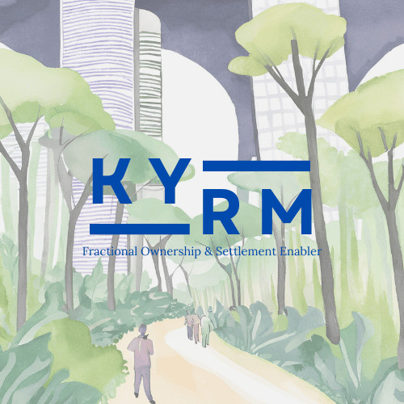

### Overview: KYRM ( कर्म ) Realty | Fractional Ownership, Simplified

KYRM is building **market infrastructure for fractional ownership and alternative investments**. The realty arm's initial focus is real estate financialization in India, leveraging the transformative opportunity unlocked by SEBI's recent SM-REIT regulatory framework.

We aim to bring professional wealth & asset management standards to real estate brokering & investing by empowering new-age agents with right tools & procedures - enabling thematic curation of professionally managed real estate assets that can be aggregated into "SM-REIT Ready" portfolios suitable for public listing. Think 'Smallcase for fractional ownership', eventually as a digital public infrastructure.

---
### The Opportunity: India's Financial Evolution

***Making Alternative Investments Accessible with Fractional Ownership***

India's wealth creation story is evolving. The transition from a savings culture to financial investment revolution was fueled by successes of the 'Mutual Fund Sahi Hai' campaign, digital KYC adoption, and the rise of S.I.P. culture through discount brokerages. 

The mutual fund AUM going from \~ ₹1T (2000s) to [\~ ₹70T (2024)](https://www.amfiindia.com/indian-mutual) demonstrates Indians' growing appetite for regulated financial products & hedged exposure. But even after all this growth, India's household wealth landscape tells a compelling story about which is the most desired asset class:

* **50% of India's wealth is locked in Real Estate**  
* 15% is in Gold, 14% in Bank Deposits, and around 4% in Cash  
* Remaining 17% is equally split amongst Equities, Insurance & Pension Funds  
* (Source: Jefferies, March, 2023\)

India loves its FDs, Gold & Real Estate. Yet premium high-yield real estate investments have remained the domain of institutional investors and HNIs, with minimum investments often running into crores. The combination of high ticket sizes, need for professional management, and prevalence of informal transactions has kept this asset class out of reach for most investors.

As we transformed from physical stock certificates to dematerialized mutual funds, we're now moving from property papers to digital real estate co-ownership. With the blessings of SEBI, Small-Medium Real Estate Investment Trusts (**SM-REITs**) represent a similar inflection point for real estate financialization. It **provides a public exit avenue to compatible real estate portfolios**, and thus sanctity to private fractional ownership models that gained momentum post-covid. 

But this isn't just about the regulatory tailwind or technological potential \- at the core, it's about **democratizing professionally managed quality real estate investments for investors from all walks of life.** It's about making India's most loved alternative investment asset class accessible with fractional ownership.

---
### Why Now: The SM-REIT Catalyst

***Real Estate का Mutual Fund Moment\!***

REITs (Real Estate Investment Trusts) transform real estate into a liquid, exchange-traded security. They provide regular income through rental yields plus potential capital appreciation, all while being professionally managed. While SEBI notified REITs in 2014, **only four REITs with \~1T INR market cap exist as of 2024** despite strong demand for the asset class \- as evidenced by Infrastructure Investment Trusts (InvITs) reaching \~2T INR market cap.

This slow adoption stems from two key constraints in traditional REITs:

* High entry barrier with minimum portfolio requirement of ₹500 crore  
* Mandatory 20% sponsor holding, typically by the developer/PE owner of the original portfolio, creating potential misalignment with retail investor interests.

The supply bottleneck led many private fractional ownership platforms to cater to assets below REIT thresholds \- from pre-leased commercial properties (Strata, Property Share, hBits) to managed vacation homes (Alyf, Yours) and farms (Hoshachiguru, Beforest).

**SEBI's 2024 SM-REIT regulations address these limitations head-on**:

* Reduced minimum scheme size to ₹50 CR  
* Replaced 20% sponsor requirement with 5% skin-in-the-game for investment managers (15% for leveraged schemes)  
* **Prohibited related party transactions** to protect investor interests  
* Enabled tax pass-through benefits and lower stamp duty on equity transactions  
* Improved liquidity through public market listing

These investor-friendly changes can make SM-REITs more attractive to even domestic institutional investors like mutual funds and insurance companies, which have till now avoided REITs more or less. Crucially, SM-REIT regulations prohibit investment managers from related party transactions. This regulatory setup will drive a two-phase transformation:

1. Proliferation of private fractional ownership compatible offerings as players race to build listing-worthy portfolios  
2. Consolidation and public listings as SM-REIT managers seek quality assets/portfolios for their schemes

**This creates a natural opportunity for private market players to build and curate "SM-REIT Ready" portfolios** that can be acquired by licensed SM-REITs for public listing. We are thus entering the Indian Real Estate ka Mutual Fund Moment\!

Fractional Real Estate & **SM-REITs offer an attractive yield-generating instrument between FDs & Equities from a risk-reward perspective**, with the added benefit of professional management at scale. 

Just as smallcase transformed retail access to portfolio investments in public markets, **KYRM Realty aims to be the technology infrastructure enabling discovery, aggregation and professional management of fractional real estate investments across both private and public markets.** 

---
### Market Evolution & Opportunity

The SM-REIT regulatory unlock will begin the next phase for India’s real estate financialization story: 

1) **Limited REIT Access & FOP Inception (2014-2023)**       
   - Only 4 REITs with ₹1T market cap vs ₹2T for InvITs  
   - Fractional ownership platforms operating within MCA gambit (Pvt Ltd, LLP)  
   - Limited to premium commercial assets or tier-1 cities  
   - No mass adoption or market participation.

1) **“SM REIT Ready” Fractional Ownership Proliferation (2024-2028)**  
   - Regulatory clarity driving inventive to formalization  
   - Unbundling, rebundling of Market infrastructure:  
     - Investment management services  
     - Portfolio discovery & curation tools  
     - Transaction & settlement systems  
     - Primary & secondary market making  
   - Geographic expansion beyond top cities  
   - Asset class diversification beyond offices:  
     - Pre-leased commercial (hospitals, data centers, schools, retail, etc.)   
     - Sale-leaseback opportunities to unlock growth capital  
     - Managed lifestyle assets like vacation homes and farms  
   - Explosion from current 10+ fractional platforms to 1000+ investment managers  
   - Projected $60B immediate opportunity by 2026 (Source: [CBRE](https://www.cbre.co.in/press-releases/potential-market-value-of-sm-reit-in-india-likely-to-surpass-usd-60bn-by-2026))   

1) **Market Maturation (2028+)**  
   - Deep retail and DII participation via SM-REITs  
   - Consolidation of private portfolios to public listings pipeline  
   - Sophisticated financial products & secondary market instruments  
   - Projected ₹100T AUM opportunity over next two decades, paralleling mutual fund evolution

Here is a [youtube clip](https://www.youtube.com/watch?v=8MUl4H6f1-g) of IIMB Prof. Venkatesh & Alt Capital (previously PropShare) CEO Kunal M. discussing the radical possibilities that SM-REIT driven innovation can bring to the whole investment management landscape. This is KYRM’s long term vision post success in the real estate asset class.

---
### KYRM Realty's Proposition: ‘Smallcase’ for Fractional Alternative Investments  

***Go from Landlord to Shareholder with KYRM’s Prime Brokerage & Technology Platform***

KYRM is building comprehensive market infrastructure for fractional ownership, starting with real estate. Our platform ecosystem will power the entire investment lifecycle \- from discovery and transaction to ongoing management \- enabling any player to launch and scale fractional investment products across private and public markets. The platform vision includes:

1\. Investment Management System

*    Portfolio Builder: Standardized deal structuring with compliance automation  
*    Smart Cap Table: Automated share allocation and investor rights management    
*    Investor Relations Hub: Integrated reporting and communication tools  
*    White-Label Portals: Customizable investment platforms for partners

2\. Transaction Infrastructure  

*    Smart Escrow Engine: Automated payment flows and settlement  
*    Digital Documentation: Standardized agreements with e-signing  
*    Verification Suite: Integrated KYC and compliance checks  
*    Title Transfer System: Streamlined title due diligence, registration & tokenization tools

3\. Market Infrastructure

*    Discovery Engine: Portfolio listing and matchmaking  
*    Secondary Market: Transfer facilitation and price discovery  
*    Analytics Suite: Risk scoring and performance benchmarks  
*    Asset Services: Property management integration  
*    Distribution APIs: Embedded finance offerings in existing platforms

---
### Appendix
We believe that one way to solve inequality is to bridge the gap between capital and labour arbitrages. This is because the rate of return on capital investments is most often more than wage inflation, thus sooner one’s labour converts into quality capital, higher are their prospects to not fall behind the curve. KYRM advances this mission by making quality capital investments - previously reserved for the HNIs and institutional investors - more accessible and federated for Indian investors from all walks of life. It also unlocks easier asset-light expansion models for MSMEs, who will eventually create the 100 million jobs India needs in the coming decades.

*The next decade will see real estate investment transform from physical to financial assets, just as demat accounts transformed stock investing. **KYRM aims to leverage this transformation to make wealth management more federated.**.*

KYRM's DPI will empower investment managers to seamlessly launch, manage, scale & aggregate their curated opportunities on our robust, techno-legal platform. This can also become driving force behind the pre-SM-REIT journey, propelling private real estate portfolios towards successful public listings, if need be. Beyond real estate, KYRM is also proposing opportunities in secondary private equity markets (requires similar tech capabilities) and gold/artefacts (crucial checkpoint for the next 10-20 year roadmap to prepare for a future where modern monetary theory will not work), along with a framework for Open, Interoperable, Sovereign Banking leveraging CBDCs & Stablecoins.

