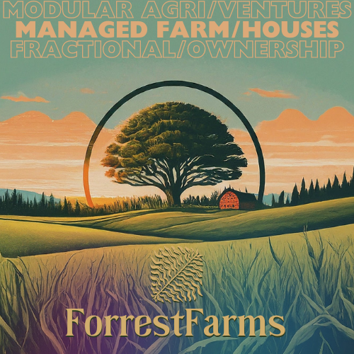

# Agriculture, Land & Energy

### Overview: An integrated regenerative strategy 
> Reimagining the relationship between land use, responsible wealth creation, and human well-being. 

India has significant agricultural land that's either underutilized or suffering from degradation due to past practices. There's a clear need for a transition towards **regenerative approaches** – methods that actively restore soil health, enhance biodiversity, and create sustainable economic opportunities. This framework offers a practical path to achieve this, built on professional coordination and the empowerment of local enterprise.

The central challenge lies in improving diverse land parcels effectively, especially when landowners have different goals (from capital appreciation to active farming) and often face a lack of specialized expertise. Our model addresses this by using **focused coordination to support a network of local micro-entrepreneurs** who operate modular, specialized agri-businesses directly on these lands.

These entrepreneurs, skilled individuals from the local community, manage specific units—such as regenerative crop systems, composting operations, nurseries, or primary food processing. They can potentially leverage schemes like **PMEGP** to get started. Operations follow **standardized playbooks and quality controls, structured similarly to a federated franchise system.** This approach builds local skills and fosters a sense of ownership, allowing multiple synergistic businesses to operate on a single land parcel. It’s a **step-by-step, composable method** for land transformation, designed to de-risk the process for both landowners and the agri-entrepreneurs. These diverse agri-businesses are the core engines driving both economic returns and ecological healing.

A major hurdle for regenerative agriculture is the upfront cost and time needed for soil restoration before profitability. The framework incorporates **practical support mechanisms for this transition phase.** For example, where suitable, a local **Compressed Biogas (CBG) plant** can act as a crucial catalyst. During the soil regeneration period, it offers a guaranteed market for specific biomass crops, providing vital early income. Additionally, the CBG's organic digestate serves as a low-cost fertilizer, accelerating soil health improvements for all associated ventures. This CBG support is designed to be **sequential:** once a property's soil is restored and it shifts to higher-value crops, the CBG's primary demand for "transition biomass" moves to assist the next property beginning its regeneration. This makes it a shared resource, a **rolling catalyst that underwrites and accelerates** the difficult shift across multiple properties.

The result is a resilient, scalable model for land revitalization, combining the drive of local entrepreneurs with professional standards and intelligent, temporary support where it’s most needed. The long-term objective is to continuously enhance the land's ecological and economic value, ultimately developing these areas into **"regenerative real estate"** – integrated, circular-economy-aligned spaces combining productive agriculture with potential for residential, commercial, and dedicated conservation zones.

---
### Problem Space

##### Land Use Challenges

- **Land Degradation:
    - Conventional practices cause widespread soil depletion, biodiversity loss, and disrupted natural ecosystems
	- Farm productivity diminishes despite rising chemical inputs
	
- **Investment Property Utilization**: 
    - Passive investors with capital appreciation focus lack trusted, low-risk utilization options for their agri-land        
    - Fear of "land-grab" prevents experimental/temporary use
    - Professional agri-management services are limited

##### Agricultural System Issues

- **Food Quality & Health:** 
	- Chemical-intensive farming compromises food safety & nutrition
	- Agrochemical exposure creates growing health concerns
	- Limited access to verified organic alternatives

- **Trust & Verification:** 
	- Widespread skepticism about product authenticity
	- Limited accountability in organic supply chains
	- Weak organic certification systems

- **Systemic Inertia**: 
	- Decades of misdirected policies and entrenched economic interests create socio-political resistance to regenerative transitions
	- Operational/upskilling inertia favors the status quo of unsustainable methods
	- Insufficient investment in (regenerative) agriculture's marketing, awareness, infrastructure

##### Socio-Economic & Energy Gaps

- **Rural Development Concerns**
	- Limited economic opportunities due to excessive reliance on conventional farming
    - Insufficient value-addition in agricultural supply chains
    - Need for diversified rural income sources

- **Urban Consumers Disconnect**
	- Separation from food systems limits consumer understanding of ground realities
	- Weak consumption-production feedback; lack of appreciation for authenticity

- **Energy Import Dependence**
	- India imports most energy needs (crude oil to solar cells), straining national current accounts and forex reserves
		- This Fossil fuel economy further proliferates plastics without much incentives/systems for responsible end-of-cycle strategy like recycling

---
### Market Trends
Several significant market trends create a favorable environment and highlight growing alignment with regenerative approaches:

##### Rise of Purpose-Driven Economics

- **Regenerative Agriculture:**
	- Rising interest in natural, quality food production to avoid ecological exploitation
    - Growing movement improving soil health, biodiversity, carbon sequestration, water management for better overall nutrition and land/produce health
    - Exploration of biofuels, though often lacking regenerative sourcing (typically relying on exploitative agriculture

- **Sustainable Business Models:**
    - Emergence of frameworks like [Doughnut Economics Toolkit](https://www.youtube.com/watch?v=ViHwewmuArI), [R3-0 Blueprint](https://www.r3-0.org/), [Sustainable Development Goals](https://sdgs.un.org/goals) for public benefit business and environmental sustainability
    - Growing investor interest in businesses with ecological focus. 
      For example, below is the investment requisites from [Rainmatter Foundation](https://rainmatter.org/):
	    - **Rewilding - More Forest Everywhere** — Your organisation works on or encourages direct rewilding of spaces, or encourages better soil management and biodiversity at farms, in public spaces and the commons in turn making every space a little more forest-like.
		- **Resilient Ecosystems, Conservation and Restoration** — Your organisation works to tackle air pollution, responsibly manages water resources, or is engaged in other similar domains.
		- **Localized Production and Consumption** — Your organisation drives more local production and consumption, and boosts livelihood creation, especially outside tier-I cities.

##### Evolving Consumer Demands

- **Health & Food Awareness:**
	- Increasing consumer interest in food origins and production methods (e.g., influencer Food Pharmer)
    - Growing concern over health impacts of chemical-intensive farming and poor quality control
    - Slowly increasing willingness to pay a premium for verified organic/regenerative produce, including D2C farm-to-fork models
    - ([Akshayakalpa](https://akshayakalpa.org/), [Anveshan](https://www.anveshan.farm/), [Farmizen](https://www.farmizen.com/), [@acanxa](https://www.akankshapandey.com/))

##### Real Estate Innovation

- **Wellness Integration:**
    - Nature-integrated design gaining prominence in property development
    - Increasing demand for health-focused amenities
    - Growing preference for sustainable building practices
    - ([Good Earth](https://goodearth.org.in/), [Total Environment](https://www.total-environment.com/), [Sanjay Puri](https://sanjaypuriarchitects.com/architecture/))

- **Ownership Evolution:**
    - Rising popularity of fractional ownership models 
    - Democratization of premium real estate access
    - Simplified management through professional services
    - ([Hoshachiguru](https://www.hosachiguru.com/), [Beforest](https://beforest.co/), [AltDRX](https://altdrx.com/), [Elevation Capital Proptech Thesis](https://elevationcapital.com/summit/insights/unlocking-value-india-proptech))

---
### Our Purpose: Vision, Mission & Value Chain Innovation

##### Vision
A world where regenerative farms, revitalized natural landscapes, local energy production and vibrant rural economies form the foundation of healthy lifestyles, prosperous communities, and a thriving planet.

##### Mission
Transform fragmented and degraded agricultural land into redeveloped, community-involved farm estates thriving on regenerative practices and sustainable local lifestyles.

##### Managed Farms/Houses
- Professional **asset management** services
	- For farmhouses, underutilized agricultural land, etc.
	- Solves for land-grab risk, informal labor, operational hassle
	- Potential for BnB and getaway experiences
- **Farm-to-family lifestyle** and natural getaway
	- For health conscious consumers and alternatives seekers
	- Solves for authenticity, agency and retreat escapades
	- Enables direct connection to sustainable food and living
- Fractional ownership of **vacation homes**
	- For small-ticket real estate investors, secondary home buyers
	- Solves for investment trust, accessibility, diversification, and yield

##### Managed Regenerative Agri-Ventures
- **Modular franchises** & playbooks for agri-allied value addition
	- For micro-entrepreneurs, agriculturists, ecosystem
	- Solves for professional standardization, value-add opportunities, job creation, entry-barriers
	- Enables systematic replication basis risk/cost profiles
- Progressive **land transformation** to organic requisites
	- For land owners/investors, CSR, philanthropists
	- Solves for land degradation, productivity, implementation risk
	- Creates pathways to making Indian land organic
- **Green & carbon credits** supply, aggregation and audit
	- For carbon footprint conscious corporates, developed economies, environmental credits markets
	- Solves for net zero emissions requirements, unit economics

##### CBG Energy &  Organic Transition Underwriting:  
- Provides Critical Anchor Demand
    - Guarantees offtake for specific biomass crops grown only during soil regeneration
    - Secures vital early cash flow, underwriting the crucial transition phase
    - De-risks investment & commitment for landowners and entrepreneurs
- Supplies Low-Cost Organic Soil Amendments
    - Delivers nutrient-rich digestate, drastically reducing external input costs
    - Accelerates soil health recovery needed for profitable regenerative ventures
    - Directly enables closed-loop nutrient cycling within the ecosystem
- Acts as a Rolling, Networked Catalyst
    - Functions as shared infrastructure supporting sequential property transitions
    - Primary biomass demand shifts systematically to new regenerating plots
    - Facilitates efficient scaling and regional adoption of regenerative practices

##### Ecosystem Enablement & Trade
- **FPO/FPC** development and support
	- For small farmers, collectives and agricultural communities
	- Enables professional aggregation and market access
	- Creates a distribution network for acquisition  
- **Natural & organic goods trade**
	- Farm to food organics supply chain
	- Value-added sustainable products
	- Quality verification and audit systems
- **Content initiatives & knowledge sharing**
	- Create content for social media sharing and documentation
	- Knowledge sharing for skill development and capacity building
	- Research and education partnerships to build funnels

##### Land Pooling & Sustainable Redevelopment
- **Land pooling** & aggregation
	- For landowners, investors & real estate developers
	- Professional facilitation and compliance management
	- Investment structuring and matchmaking
- **Sustainable redevelopment** into concept real estate
	- Regenerative farm estates development
	- Mixed-use community projects
	- Wellness and hospitality ventures
- **Value chain integration** and monetization
	- From processing centers to commercial markets
	- Lifestyle spaces and wellness experiences - cafe, resorts, flea markets, hotels, retreats, educational centers
	- Natural parks, biodiversity zones, zoological reserves

##### Key Differentiators
1. **Synergistic Integration:** Uniquely combines professional oversight, decentralized enterprise, regenerative science, smart finance, and real estate development into one cohesive system.
2. **Scalable Decentralization:** Achieves scale and resilience not through monolithic control, but via standardized modules empowering a distributed network of local entrepreneurs.
3. **Ecological Capital as Economic Foundation:** Fundamentally shifts the value premise – healthy ecosystems are the primary asset generating diverse, long-term returns.
4. **Solves the Transition Problem:** Directly addresses the critical adoption barrier for regenerative agriculture through intelligent, temporary catalytic support.
5. **Creates a New Asset Class:** Moves beyond basic agriculture or land speculation to cultivate high-value, multi-functional "regenerative real estate."

---
# Appendix

### ForrestFarms (.in) / JaivikSetu (.in .org)
Regenerative Agri-Ventures & Real Estate
- Agri-ventures - modular, composable, scalable, tax optimised 
- Infrastructure - Circular CBG Plant, Storage, Processing Units
- Natural & organic goods producer and supplier
- Sustainable redevelopment & concept real estate  

