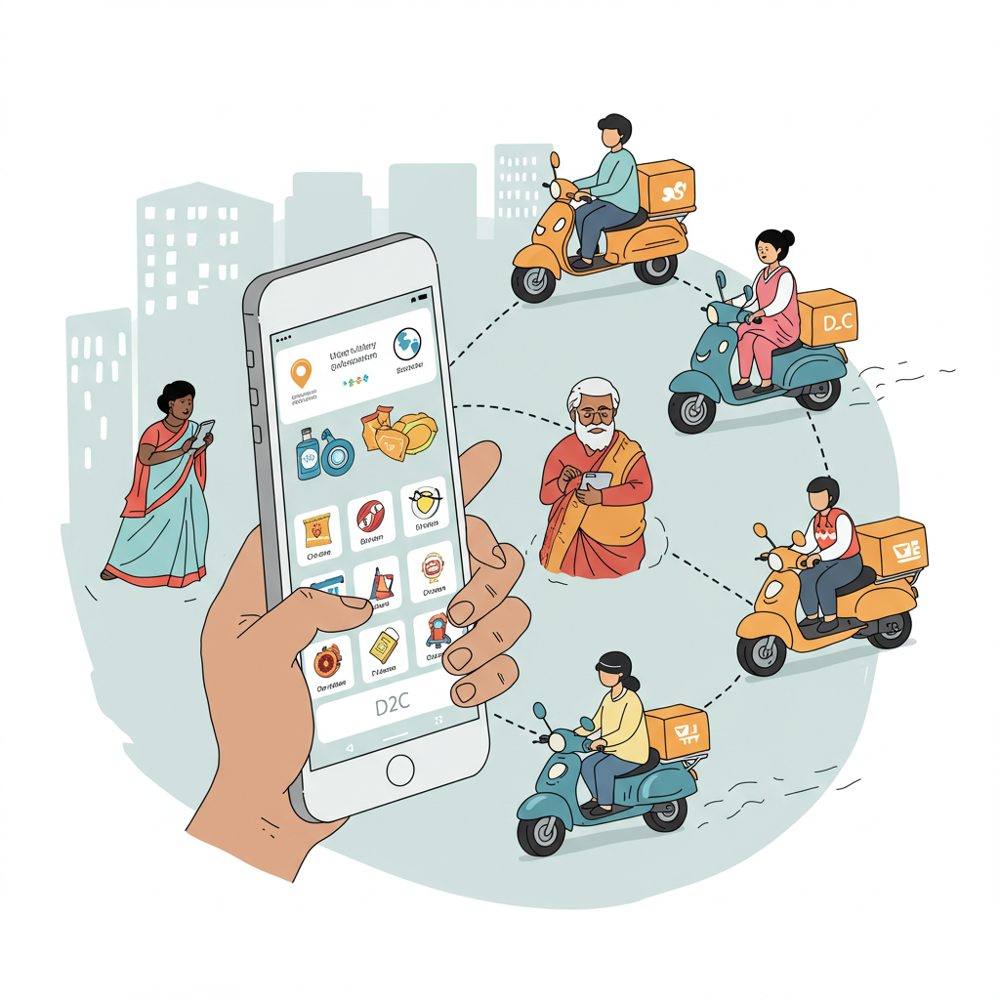
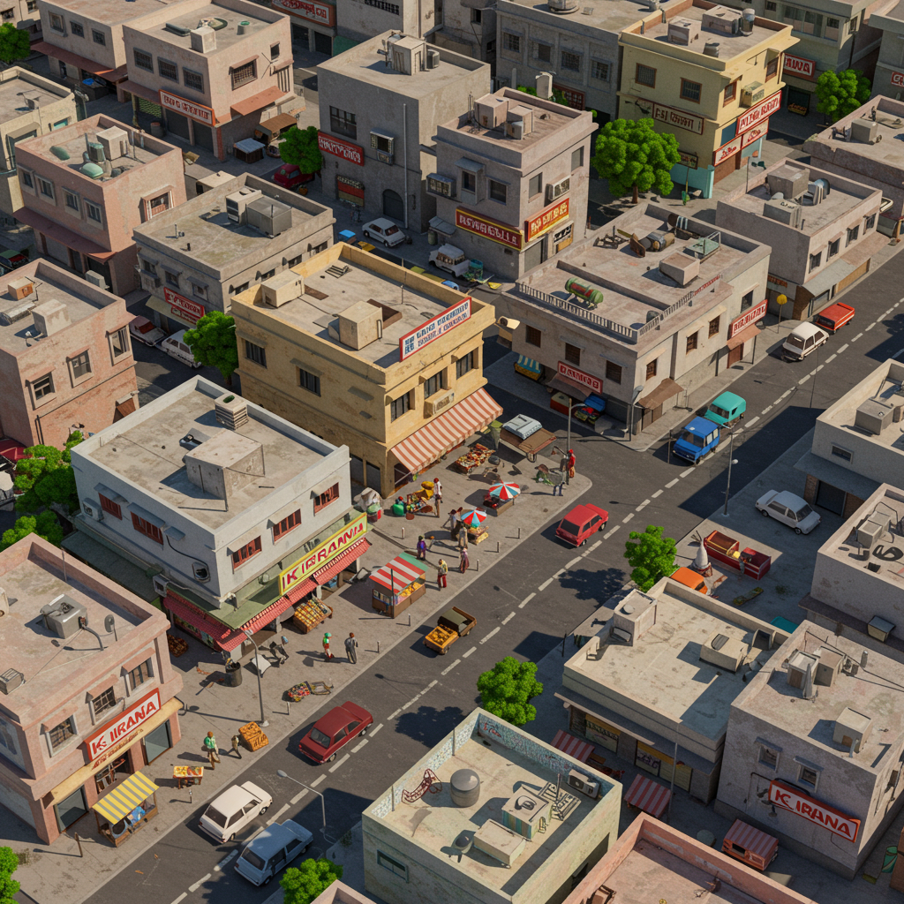

# KiranaCulture: Federated Quick Commerce. Local Roots, Lightning Speed.  

> (2014P_Samatvartha / Consumption Module / AdVenture Memo)

> https://www.costbo.com/ is quite similar model, so make them a sutradhaar instead of working on this independently as 2014P
 
### Vision:
A decentralized quick commerce backbone for India. Empowering new-age local entrepreneurs (or next generation of Kiranas, stockists) and D2C brands, making hyperlocal delivery efficient, accessible, and community-centric. A federated, Samatvartha-aligned alternative to capital-intensive, centralized dark store models.

### The Problem & The Opportunity:

- **High Centralized Capex/Opex:** Company-owned/leased dark stores lead to massive burn for expansion (rent, staff, utilities) hitting margins, as seen with Blinkit.
- **Complex Franchise Models:** Often not true "ownership" for the operator; more like managed leases with limited autonomy.
- **D2C Brand Dilemma:**
    - High "platform commissions" (e.g., 30-35% for oral care on Blinkit).
    - Complex fee structures: Upfront storage, daily aging fees, fulfillment fees, recall fees.
    - Lack of transparency on exact inventory location and sales points.
    - Dependency on centralized warehouse networks before reaching dark stores.
- **Untapped Local Potential:** Existing Kiranas, Super-stockists and underutilized commercial spaces struggle to integrate into high-speed logistics and technology native operations of quick commerce. 
- **Federation Synergy:** D2C brands need asset-light hyperlocal reach; local entrepreneurs need a viable path to modernize.
    

### KiranaCulture: The Federated Solution – Empowering the Ecosystem

- **What It Is:** A tech-enabled ecosystem ("digital commons") connecting:
    - **D2C Brands:** Seeking asset-light, ultra-fast market access with transparent, predictable costs.
    - **Micro-Fulfillment Operators ("KiranaCulturists"):** Empowered local entrepreneurs (including next-generation of Kiranas or Wholesalers) running hyper-efficient, independently managed dark/edge stores. Their business is operational excellence, not direct sales.
    - **Commercial Real Estate (CRE) Owners:** Monetizing space via tech-integrated, stable tenants, potentially leveraging **KYRM Realty** for fractional investment & asset management of these fulfillment nodes.
    - **Third-Party Logistics (3PL):** For optimized, potentially aggregated, last-mile delivery.

> A strategic consideration for **QC incumbents**: This federated model could also appeal to Quick Commerce incumbents. Faced with high capex (e.g., Swiggy Instamart's reported ~₹20L per store loss vs. Blinkit's ~₹20L profit as per [ASYMMETRIC Podcast](https://www.youtube.com/watch?v=2Pt92wj6-t8), or Flipkart Minutes scaling back expansion from 500 dark stores to just 8 cities), these platforms could leverage KiranaCulture to compete more agilely against Blinkit's ~50% market share, while reframing their narrative from Kirana competitors to enablers. This fork remains under exploration.

### How It Works: Value Realigned

- **For D2C Brands:**
    - **Plug-and-Play Hyperlocal Network:** Access customers in 15-45 mins (intra-city "Edge Stores") or 2-4 hours (peri-urban "Dark Stores").
    - **Transparent "Shelf-Space-as-a-Service":**
        - Primary Cost: **SKU-level "Ageing Rental"** – pay for precise shelf space occupied, with clear tiers for inventory turnover. Replaces complex upfront storage + daily aging fees.
        - Secondary Cost: Per-order fulfillment/dispatch fee (to KiranaCulturist/3PL).
    - **No Platform Sales Commission to KiranaCulture:** Brands sell on their own channels or ONDC; KiranaCulture is the fulfillment orchestration layer.
    - **Focus on Product & Marketing:** Outsource hyperlocal fulfillment complexity.
    - **Direct Inventory Placement:** If efficient, ship directly to federated KiranaCulture nodes, bypassing multiple central warehouse hops.
        
- **For KiranaCulturist Proprietors (Upgrading Kiranas & Stockists into Darkstores ):** **Proprietors:**
	- **Level the Playing Field with Turnkey Operations Model:** Focus solely on efficient:
	    - Space management & SKU organization.
	    - Inventory receiving & quality checks.
	    - Rapid order picking, packing, and handoff to 3PL.
	        
	- **KiranaCulture Tech Suite (Digital Commons):**
	    - Manages inventory visibility for D2C brands.
	    - Receives dispatch orders (from D2C via API / ONDC).
	    - Optimizes 3PL integration & dispatch.
	    - Provides operational analytics.
	        
	- **Revenue Streams:**
	    - Primary: Share of the "Ageing Rental" paid by D2C brands for space utilization.
	    - Secondary: Per-order handling/dispatch fee.
	        
	- **Low Capex Entry / Upgrade Path:**
	    - **"Edge Store":** Upgrade existing Kirana space for hyper-fast fulfillment of select D2C SKUs.
	    - **"Dark Store":** Establish new, smaller footprint fulfillment hubs, potentially financed/managed via KYRM-like structures.
	        
	- **True Entrepreneurship:** Build a sustainable local business centered on operational excellence.
        
- **The KiranaCulture Tech Layer (Digital Commons Protocol):**
    - **Inventory & Order Orchestration Engine.**
    - **Operator Toolkit & D2C Brand Portal.**
    - **Open APIs:** For D2C, ONDC, 3PL, and KYRM (for CRE integration).
    - **Data Insights (Aggregated & Anonymized):** Demand patterns, inventory velocity for network optimization.
        

### Why KiranaCulture? The Strategic Edge:

- **Empowers, Not Replaces:** Strengthens the existing retail fabric by upgrading it.
- **Transparent & Fair D2C Economics:** Shifts from high sales commissions and complex fees to predictable operational service costs.
- **Federated & Resilient:** Distributed network, no single point of failure.
- **Capital Efficient & Scalable:** Leverages existing/smaller CRE, asset-light for D2C brands.
- **Win-Win Economics:** D2C brands save on commissions, local entrepreneurs gain new income streams.
- **Consumer Choice & Delight:** Faster access to a wider variety of D2C products through familiar local points.
- **ONDC Native (Optional & Synergistic):** Can act as a powerful fulfillment network for sellers on ONDC, allowing D2C brands to retain control over their sales channels. ONDC is struggling, this can be the product-market fit for it.

##### The Master Stroke:

- **KiranaCulture as a "Fulfilment Utility":** Just like electricity or water, it’s the essential infrastructure D2C brands plug into for hyperlocal reach. It upgrades the existing - and ultra efficient - distribution networks, instead of replacing them with single corporate owned last mile fulfilment. 
    
- **KYRM Powered CRE:** Creates a flywheel where investment in local commercial real estate directly fuels the growth of the KiranaCulture fulfillment network. Can aid with working capital for expansion as well with real estate equity dilution.
    
- **"Edge Store in a Box":** Standardized kit/playbook/toolkits and peer-community for Kiranas to quickly convert a section of their store into a KiranaCulture node. (Please read the readme for Samatvartha Thesis and why we care about this.)
    
- **Data-Driven Network Balancing:** Use network-wide inventory and demand data to guide D2C brands on optimal stocking across different nodes, minimizing stockouts and overstocking. D2C brand shall own their customers' data, and shall forecast better inventory management across edge nodes. Synergetic with ONDC, so integration potential is a smooth curve. 
    
- **Community Logistics Pools:** Facilitate shared 3PL resources among clusters of KiranaCulture nodes to drive down last-mile costs. From Porters to Shadowfax of the world.

---

### Go-To-Market (GTM) Proposal: Phased & Catalytic

- **Goal:** Seed the first few successful nodes and D2C partnerships to create a proof-of-concept and attract network effects.
    
- **Phase 1: Pilot City Launch - "Anchor & Grow"**
    
    1. **D2C Brand Syndicate Activation:**
        
        - Partner with a consortium of 20-50 complementary D2C brands liek Barbershop with Shantanu Syndicate etc.
        - **Value Prop:** Offer them a cost-effective, commission-free pilot for hyperlocal fulfillment in one city. Their collective volume provides initial demand for the first nodes.
        - They commit to stocking agreed-upon SKUs in the pilot KiranaCulture nodes.
            
    2. **Curated Proprietor Onboarding:**
        - Identify and onboard 2-3 initial "KiranaCulturist" proprietors in strategic locations within the pilot city.
        - **Ideal Profile:** Tech-savvy next-gen Kirana owners, ambitious local entrepreneurs, or even ex-employees of logistics/retail firms.
        - Provide intensive training, tech setup, and operational playbooks.
	        - Tap into existing quick commerce employees to come onboard for this initiative and shape this vision with their practical learnings. Betting on reverse migration to tier 2/3 as well, but can happen remotely as well.
        - **(Optional Catalyst):** The D2C syndicate could offer micro-seed funding or inventory credit to de-risk initial proprietors, facilitated by 2014P_ or a dedicated SPV, though our first preference is to keep sole proprietorship everything as that aligns more with out overall Samatvartha Network State vision for regenerative economics.
            
    3. **Tech MVP & Integration:**
        - Launch the core KiranaCulture tech platform (inventory, order routing, basic analytics, minimal viable views & flows).
        - Integrate with anchor D2C brands' order systems (Shopify APIs, etc.) and a local 3PL partner.
            
    4. **Metrics for Success:** Fulfillment speed, D2C cost savings vs. incumbent platforms, proprietor earnings, inventory turnover, end-user NPS. 
        
- **Phase 2: Expansion & Network Effects**
    
    1. **Showcase Success & Attract:**
        - Use pilot city data to demonstrate clear ROI for both D2C brands and proprietors.
        - Targeted outreach to more D2C brands (especially those vocal about high marketplace fees).
            
    2. **Organic Proprietor Growth:**
        - Develop a "KiranaCulturist Fellowship" with Anvi Kriti & Intercamp Initiative of Samatvartha to attract and train more operators.
        - Actively engage with Kirana associations and stockist networks to present KiranaCulture as an upgrade path.
            
    3. **Geographic Expansion:** Replicate the model in new cities based on D2C demand.
        
    4. **Tech Enhancement:** Build out advanced features based on early learnings (e.g., demand forecasting tools, dynamic routing, shared delivery, etc. with help of value chain partners improving their integrations).
        
- **Alternative/Parallel Approach: "Kirana First" Conversion**
    
    - While D2C-led demand ensures initial node viability, a parallel track could focus on:
        - Developing an ultra-simple "Edge Store in a Box" kit for existing Kiranas.
        - Targeting dense neighborhoods with high D2C consumption.
        - Pitching this as a way for Kiranas to become fulfillment points for any ONDC-enabled seller or local D2C brand, even without direct KiranaCulture onboarding of the brand initially. This makes the Kirana the "attraction point."
            
- **Key GTM Principle:** Start focused, prove the model with strong anchor partners, then leverage that success to build out the federated network. Prioritize creating tangible value for the first users.

- The Late-entrant / less market-share strategic pivot for Flipkart Minutes, Swiggy Instamart possibility. But this is parked for now.

---
# Appendix 

##### The Kirana Culture Journey:

