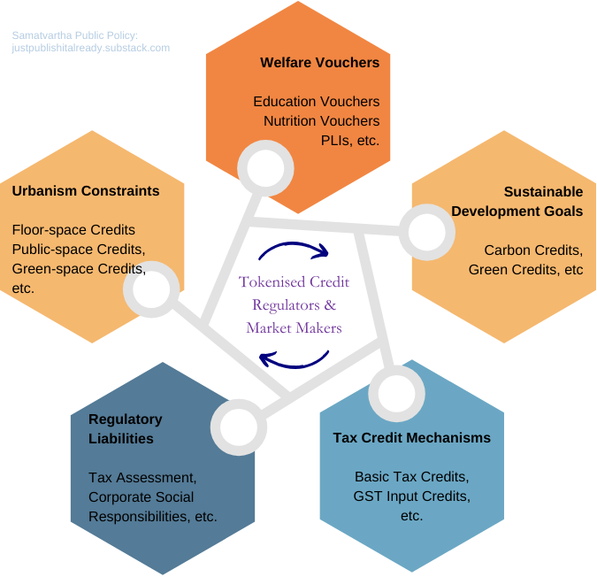

This is a quick excerpt from Samatvartha Policy Design Framework, presented as a proposal for Urbanism policy for Avanti Metropolitan Region (aka Indore-Ujjain Metropolitan Region). This is part of a broader thesis by 2014P_ a Think Tank and Venture Lab working towards proliferating regenerative economics in Bharat.

We call it Samatvartha. "Sāmatva" (balance/equilibrium/resonance) + "Artha" (purpose/prosperity/meaning), aiming to harmonise economic activity with ecological and social well-being. 

2014P_ is more than happy to work with administrators & politicians to help shape policy compatible with Samatvartha, while keeping up with the cutting-edge of technology and economics. I am [Nilesh Lahoty](https://www.linkedin.com/in/lahnil/), founder of 2014P_ Think Tank & Venture Lab. I pursued Economics & Mechanical Engineering from BITS Pilani, after which I worked with Goldman Sachs for four years in their Treasury division. More details about Samatvartha for Public Policy & Private Sector are being documented here in 8_Public_Policy)Samatvartha_Stack folder: [https://github.com/Samatvartha/2014P_Samatvartha_Thesisbox](https://github.com/Samatvartha/2014P_Samatvartha_Thesisbox)

> यह लेख नीचे हिंदी में भी उपलब्ध है। [[#अवंती के भविष्य का पथप्रदर्शन]]

### Tl;dr: A Regenerative Path for Avanti's Ascendance

**The Vision:** Transform the Avanti (Indore-Ujjain) & Bhopal Metropolitan Region into India’s most livable and competitive urban agglomeration. Instead of just another sprawling Tier-II city, Avanti can pioneer a *regenerative* model rooted in **Samatvartha** – balancing prosperity with ecological and social harmony.

**The Strategy:**

* **Innovative Funding & Development:** Introduce a tokenized system for **Green-Space, Public-Space, and Air-Space Credits**. This market-based mechanism ensures sustainable development, funds public infrastructure (like transit from air-space right auctions), and creates vibrant, well-serviced localities.

* **Adaptive Governance:** Move away from rigid masterplans towards simpler, outcome-focused heuristics that allow the region to evolve organically and resiliently.

* **Green is Gold:** Prioritize extensive green cover as critical infrastructure, boosting the living index and attracting talent. Think streets cooled by 10°C naturally!

* **Smart Transit, Not Just Metros:** Implement a multi-modal transit system: efficient smaller buses, modern trams, tree-covered cycle & pedestrian tracks, and a robust suburban rail/RRTS connecting the entire region (Indore, Ujjain, Dewas, Dhar, Shajapur). This offers better connectivity and quality of life than car-dependent or metro-only models.

**The Urgency & Opportunity:** With the Hon'ble Chief Minister, Dr. Mohan Yadav ji, greenlighting the Indore-Ujjain metropolitan development and the upcoming cabinet meeting (potentially at Rajwada on May 20th), the timing is perfect to adopt this forward-thinking framework. Let Avanti lead by example, showcasing how urban India can achieve true *Samatvartha* – a harmonious blend of growth, meaning, and ecological well-being, setting a new benchmark for the nation.

### Masterplan for Urban Decline? Or a Blueprint for Regenerative Growth?

India is urbanizing; India *needs* to urbanize. Our cities, towns, and villages are superorganisms that live and die alongside this migratory oxygen. But must this mean endless migration to ever-larger cities with deteriorating civic amenities? Or can we catalyze a "Cambrian explosion" of vibrant local urban clusters emerging from their rural or sub-urban past?

The current urban planning process in India – a tangle of multiple local bodies, rigid master plans, and restrictive zoning – often stifles organic growth and efficient land use. As rapid urbanization strains infrastructure, we see symptoms like Bimal Patel’s example of “dead” setback land in Mumbai – land that could be thriving public streets or civic centers. Reclaiming such underutilized spaces is just one piece of the puzzle.

*(Image Source: Bimal Patel's public articles, illustrating land use comparison)*

Consider Mumbai (Island City): only 24% land in the public domain versus 40% in cities like London or New York. This highlights a systemic inefficiency. Furthermore, arbitrary rural/urban classifications and the resulting regulations fail us when cities inevitably expand beyond outdated "masterplans." This uncontrolled sprawl degrades livability, harms the environment, and deepens social inequalities. The influx of migrants, seeking better lives, often find themselves in areas with inadequate housing, overburdened transport, and scarce basic amenities.

[Source: DownToEarth](https://www.downtoearth.org.in/factsheet/internal-migration-in-india-why-where-how-much-71283)

Add to this poor local governance and supporting ecosystem like think tanks or consultancies, lack of accountability & feedback, an automobile-centric worldview overshadowing the need for tree cover and diverse civic amenities, a shadow real estate economy, perplexing regulations from FSI to setbacks, and a general disregard for natural ecosystems – our cities are struggling.

We aren't arguing for *more* top-down planning. We disagree with overly rigid, grid-focused approaches. For complex adaptive systems like cities, especially in a densely populated nation like India (10x the density of the US, 5x Europe, 2.5x China), simple, effective heuristics are far superior. **India might admire Chandigarh, but it’s a model unsuited for our dynamic urban future.** What India truly needs are hundreds of "Singapores" and "Kyotos" – cities where nature, heritage, and modern urban living blend seamlessly with a regenerative spirit. And unequivocally, more trees and less asphalt everywhere!

*(Image: Illustrating the stark difference between green, walkable urban spaces and asphalt-dominated ones)*

The Doughnut Economics Action Lab offers an exhaustive [Urban Development Manual and Toolkit](https://doughnuteconomics.org/tools/doughnut-for-urban-development-manual-and-tools) for holistic assessment. Our proposal complements such frameworks by focusing on a **tokenized protocol for air-space, greenery, and public-space credits** to accelerate this regenerative journey.

*(Image: Doughnut Economics model - The Safe and Just Space for Humanity)*

### An Ingenuous Proposal for Avanti (to begin with)

What’s needed?
* **Stability and Certainty:** Policy shouldn't be a weather vane, changing with every political season.
* **Open-mindedness:** Being pro-environment doesn't mean regressing; it means progressing intelligently.
* **Non-disruptive Transition:** New policies must be implemented thoughtfully, with smart change management that is not overtly disruptive to current stakeholder

Let's re-examine the monetary and fiscal dimensions of urbanism through the lens of Samatvartha.

### From Destructive Economics to Regenerative Growth

In an embedded economy, decisions are shaped by social relationships, cultural values, and moral concerns – *Dharma* in its ideal sense. Every economic transaction, therefore, has an socio-ecological dimension. (nṛ ṛṇa & bhūta ṛṇa - aka karmic debts.)

*(Image: The Embedded Economy - showing economy within society and earth, with regenerative/destructive flows)*

Samatvartha identifies **"Four Parallel Circular Economies"**:

1.  **Regenerative:** Actively restores ecosystems and communities (e.g., agroforestry, community energy).
2.  **Sustainable:** Maintains balance without significant negative externalities (e.g., natural farming, ethical finance).
3.  **Degenerative:** Depletes resources or harms social fabric, causing near-permanent damage (many current industrial practices).
4.  **Destructive:** Causes severe, often irreversible damage (e.g., fossil fuels, large-scale deforestation).

> Our focus is reclaiming [Ṛta](https://www.google.com/url?sa=E&q=https%3A%2F%2Fwww.brhat.in%2Frta) (cosmic order and truth) within our socio-ecological systems. This isn't a rejection of markets or the state, but a rebalancing, shifting functions towards federated, regenerative commons. We aim for an intentional shift to a shared regenerative future, avoiding colonial and imperial errors. This clarity is paramount.

Sāmatvārtha is India's blueprint for intentionally shifting towards these regenerative tiers, using market mechanisms, technological leverage, first principles thinking, fractal reasoning and simple heuristics, not rigid micro-management.

### Regenerative Urbanism as a Protocol for Avanti

As India urbanizes, we must pivot from car-dependent development and rigid master plans. The current paradigm leads to sprawl, environmental decay, and strained infrastructure. A new protocol, rooted in regenerative urbanism, is essential for the Avanti Metropolitan Region i.e. this Mahanagri of Rudra & Ahilya.

*(Image: Temperature differences in streets with and without tree cover)*

At its heart is a **tokenized system** incentivizing sustainable development, promoting diverse public transit, and fostering harmony between greenery, public amenities, and construction. This system mandates acquiring not just land and floor-space rights, but also **Green-Space Credits** and **Public-Space Credits** for any development.

* **Credit Valuation:** Credits are categorized by ecological value and community significance. Pristine Natural Green Spaces (4x value) and Iconic Public Spaces (4x) are prized, while Reclaimed Green Spaces (0.5x) and Potential Public Spaces (0.5x) offer accessible pathways for regeneration. This ensures development prioritizes vital green and public assets. Check image below for reference.

* **Proximity Incentives:** A discounting curve determines credit equivalence based on proximity to the development site, encouraging developers to integrate or acquire rights to *nearby* green and public spaces.

* **NFT-based Marketplace:** Tokenizing these rights via an NFT-based banking and marketplace infrastructure can scale this model across Avanti, fostering a harmonious and sustainable urban fabric that extends organically into suburban localities.

* **Funding Public Transit through Air-Space Rights:** Local authorities can 'mint' new air-space rights over existing real estate (a simpler Transferable Development Rights). Leasing or auctioning these in the 'credit' marketplace generates revenue directly channeled into funding **new public transit infrastructure** – like smaller buses, trams, or the crucial RRTS/suburban rail connecting Indore, Ujjain, Dewas, Dhar, and Shajapur – especially near the newly minted air-rights. This reduces car dependency and enhances connectivity across the metropolitan region.

* **Adaptive Local Governance:** Governance shifts to defining discounting factors, the extent of the curve, and overseeing air-space rights minting. This flexible approach allows Avanti to adapt to unique local needs. If future needs arise, say for clean-energy credits, the framework is modular enough to accommodate them.

This regenerative urbanism protocol offers a holistic approach, balancing environmental preservation, community engagement, and efficient land use. It aligns with creating urban clusters that seamlessly blend nature, heritage, and modern lifestyles, fostering inclusive growth. The upcoming **Madhya Pradesh Metropolitan Planning and Development Act 2025**, and the Chief Minister's vision for Indore and Bhopal as metropolitan areas, make this the opportune moment for Avanti to adopt such an innovative strategy.

*(Image: Urbanism as a Protocol - Green-Space Credits & Public-Space Credits categories)*

As India urbanizes, this tokenized protocol can help Avanti thrive as a vibrant, sustainable, and inclusive hub, reshaping its urban landscape for a resilient future.

### Streamlined Urban Administration & A Glimpse into Broader Welfare

The principle of tokenized credits (Green, Public, Floor-space) can extend beyond urbanism. Imagine a unified digital infrastructure for:

* **Taxation:** Similar to GST Input Credits, a system of Universal Basic Tax Credits (UBTC) could simplify compliance and enhance equity.
* **Welfare:** Tokenized credits can be used for targeted welfare delivery (e.g., education, nutrition vouchers), supporting the care economy, increasing accountability, and ensuring financial sustainability by pegging fiscal policy to monetary realities.
* **Enhanced Democracy:** "Democracy-credits," issued to taxpayers post-assessment, could allow citizens to allocate a portion of their tax contributions directly to publicly listed development projects proposed by their elected representatives. This would drastically improve civic participation and fiscal transparency.

*(Image: Samatvartha Public Policy - Tokenised Credit Regulators & Market Makers connecting Urbanism, Welfare, SDG, Tax, Regulatory Liabilities)*

This integrated approach to tokenized administration offers a robust foundation for a more responsive, efficient, and democratic governance model, aligning with the overarching Samatvartha vision of balanced and purposeful prosperity.

*(Image: Samatvartha Stack for Taxation, Welfare, Urbanism, Fiscal & Monetary)*

---

This framework, particularly its urbanism protocol, is offered for consideration as the Avanti Metropolitan Region plans its future. It is a path to not only meet the challenges of urbanization but to turn Avanti into a shining example of regenerative development for India and the world, especially timely given the upcoming **cabinet meeting in Indore (possibly at Rajwada on May 20th)**. The symbolic act of discussing the future of our cities in a historic, temporarily pedestrianized public space underscores the very principles of prioritizing public realm and heritage that Samatvartha champions.

----
---

# अवंती के भविष्य का पथप्रदर्शन
पुनर्योजी शहरीकरण और उन्नत जीवन-स्तर के लिए एक नियमावली

**संक्षिप्त में (Tl;dr): अवंती (इंदौर-उज्जैन) के लिए एक परिवर्तनकारी शहरी नियमावली**

- **लक्ष्य:** सामत्वर्थ ("सामत्व" - संतुलन + "अर्थ" - समृद्धि; पारिस्थितिक और सामाजिक कल्याण के साथ समृद्धि का संतुलन) ढांचे के एक मुख्य सिद्धांत, **पुनर्योजी शहरीकरण (Regenerative Urbanism)** को अपनाकर अवंती मेट्रोपॉलिटन क्षेत्र को भारत का सबसे प्रतिस्पर्धी और रहने योग्य शहरी केंद्र बनाना।

- **कार्यप्रणाली:** हरित-स्थान, सार्वजनिक-स्थान और हवाई-अधिकारों के लिए एक **टोकनीकृत क्रेडिट प्रणाली (tokenized credit system)** लागू करना। यह बाजार-संचालित दृष्टिकोण सतत विकास सुनिश्चित करता है, विविध सार्वजनिक पारगमन (छोटी बसें, ट्राम, इंदौर, उज्जैन, देवास, धार और शाजापुर को जोड़ने के लिए महत्वपूर्ण आरआरटीएस/उपनगरीय रेल) को निधि प्रदान करता है, और जीवंत सार्वजनिक क्षेत्र बनाता है।

- **मुख्य लाभ:** उन्नत हरित आवरण और सार्वजनिक सुविधाओं के माध्यम से जीवन-स्तर सूचकांक में मौलिक सुधार, कार-निर्भरता को कम करने वाला कुशल बहु-आयामी परिवहन, और कठोर मास्टरप्लान से बेहतर प्रदर्शन करने वाला एक लचीला, अनुकूलनीय शासन मॉडल।

- **अवसर:** माननीय मुख्यमंत्री जी द्वारा मेट्रोपॉलिटन विकास की मंजूरी और आगामी **मध्य प्रदेश मेट्रोपॉलिटन योजना एवं विकास अधिनियम 2025** के साथ, अवंती इस अभिनव, भविष्य-उन्मुख नियमावली को अपनाकर नेतृत्व कर सकता है। यह आगामी कैबिनेट बैठक में चर्चा के लिए विशेष रूप से सामयिक है।

---

### **अवंती की शहरी सफलता के लिए एक नवीन खाका**

जैसे-जैसे भारत शहरीकरण कर रहा है, अवंती मेट्रोपॉलिटन क्षेत्र एक महत्वपूर्ण मोड़ पर खड़ा है। हम पारंपरिक रास्तों का अनुसरण कर सकते हैं जो तनावपूर्ण बुनियादी ढांचे और समझौतापूर्ण जीवन-स्तर की ओर ले जाते हैं, या हम एक परिवर्तनकारी दृष्टिकोण का पथप्रदर्शन कर सकते हैं: **पुनर्योजी शहरीकरण एक नियमावली के रूप में (Regenerative Urbanism as a Protocol)**। यह प्रस्ताव, व्यापक **सामत्वर्थ** दर्शन ("सामत्व" - संतुलन + "अर्थ" - समृद्धि) का एक अनुप्रयोग, अवंती के लिए सतत विकास और उच्च जीवन गुणवत्ता का एक प्रकाशस्तंभ बनने का मार्ग प्रदान करता है, जो इसे अन्य टियर-II शहरों से अलग करता है।

पारंपरिक शहरी नियोजन, अपने कठोर मास्टरप्लान और कार-केंद्रित दृष्टिकोण के साथ, अक्सर वास्तव में संपन्न शहरों का निर्माण करने में विफल रहता है। यह अक्षम भूमि उपयोग, पर्यावरणीय गिरावट, और आवश्यक हरित और सार्वजनिक स्थानों की कमी का कारण बन सकता है - वे तत्व जो एक शहर की आत्मा और उसके निवासियों की भलाई को परिभाषित करते हैं। घनी आबादी वाले, गतिशील भारत के लिए, हमें होशियार, अधिक अनुकूलनीय समाधानों की आवश्यकता है।

### **अवंती के लिए पुनर्योजी शहरीकरण नियमावली:**

इसके मूल में, यह नियमावली विकास प्रोत्साहनों को पारिस्थितिक स्वास्थ्य और सामुदायिक आवश्यकताओं के साथ मौलिक रूप से संरेखित करने के लिए एक **टोकनीकृत प्रणाली (tokenized system)** प्रस्तुत करती है:

1. **समग्र विकास के लिए अनिवार्य क्रेडिट:** किसी भी रियल एस्टेट विकास को न केवल भूमि और फ्लोर-स्पेस अधिकार सुरक्षित करने होंगे, बल्कि **हरित-स्थान क्रेडिट (Green-Space Credits)** और **सार्वजनिक-स्थान क्रेडिट (Public-Space Credits)** भी प्राप्त करने होंगे। यह शहरी नियोजन में प्राकृतिक संपत्तियों और सामुदायिक क्षेत्रों के महत्व को तुरंत बढ़ाता है।
    
    - _मूल्यांकन:_ क्रेडिट को पारिस्थितिक/सामाजिक प्रभाव के आधार पर भारित किया जाता है (जैसे, प्राचीन प्राकृतिक हरित स्थान: 4 गुना मूल्य, पुनर्निर्मित हरित स्थान: 0.5 गुना मूल्य)।  _(छवि: हरित-स्थान क्रेडिट और सार्वजनिक-स्थान क्रेडिट की श्रेणियां)_

2. **एकीकृत हरित और सार्वजनिक स्थानों को प्रोत्साहित करना:** **निकटता के आधार पर एक छूट वक्र (discounting curve)** डेवलपर्स को _आस-पास_ के हरित क्षेत्रों और सार्वजनिक सुविधाओं को एकीकृत करने या उनके अधिकार प्राप्त करने के लिए प्रोत्साहित करता है, जिससे एकजुट, चलने योग्य और हरे-भरे पड़ोस को बढ़ावा मिलता है। यह पृथक, बंजर विकासों का प्रतिकार करता है।  _(छवि: सड़क के तापमान पर पेड़ों का प्रभाव, हरियाली के मूल्य को प्रदर्शित करता हुआ)_
    
3. **हवाई-अधिकारों (Air-Space Rights) के माध्यम से स्मार्ट सार्वजनिक पारगमन का वित्तपोषण:** स्थानीय प्राधिकरण मौजूदा संपत्तियों पर **हवाई-अधिकारों** को 'मिंट' (जारी) कर सकते हैं और उनकी नीलामी/लीज कर सकते हैं (यह हस्तांतरणीय विकास अधिकारों का एक लचीला रूप है)।
    
    - _समर्पित निधि:_ इससे प्राप्त आय को सीधे इन विकासों के पास महत्वपूर्ण **सार्वजनिक पारगमन बुनियादी ढांचे** - जैसे छोटी, लगातार चलने वाली बसें, आधुनिक ट्राम, और इंदौर, उज्जैन, देवास, धार और शाजापुर में क्षेत्रीय कनेक्टिविटी के लिए आवश्यक आरआरटीएस/उपनगरीय रेल नेटवर्क - के वित्तपोषण के लिए उपयोग किया जाता है। यह सीधे गतिशीलता की जरूरतों को पूरा करता है और निजी वाहनों पर निर्भरता कम करता है।

4. **बाजार-संचालित कार्यान्वयन:** इन टोकनीकृत अधिकारों के लिए एक **एनएफटी-आधारित बैंकिंग और बाज़ार अवसंरचना (NFT-based banking and marketplace infrastructure)** अवंती क्षेत्र में इस पुनर्योजी मॉडल की पारदर्शिता, दक्षता और मापनीयता सुनिश्चित करती है।
    

**यह नियमावली अवंती को कैसे लाभ पहुंचाती है:**

- **उन्नत जीवन-स्तर और प्रतिस्पर्धात्मकता:** हरित आवरण और सुलभ सार्वजनिक स्थानों को प्राथमिकता देने से सीधे जीवन की गुणवत्ता बढ़ती है, जिससे अवंती अधिक आकर्षक बनता है।
  
- **सतत अवसंरचना:** महत्वपूर्ण सार्वजनिक पारगमन के लिए एक स्व-वित्तपोषण तंत्र बनाता है, जिससे राजकोषीय तनाव कम होता है।
  
- **अनुकूलनीय और लचीला शहरी स्वरूप:** कठोर, शीघ्र ही पुराने पड़ जाने वाले मास्टरप्लान से परे एक ऐसी प्रणाली की ओर बढ़ता है जो उभरती जरूरतों के अनुकूल हो सके।
  
- **सामत्वर्थ के साथ संरेखण:** पारिस्थितिक पुनर्स्थापन के साथ आर्थिक गतिविधि को संतुलित करने के सिद्धांत को स्थापित करता है (पुनर्योजी/सतत श्रेणियों को क्षयकारी/विनाशकारी श्रेणियों पर प्राथमिकता दी जाती है)। 
  _(छवि: सामत्वर्थ की अंतर्निहित अर्थव्यवस्था की अवधारणा)_

### **शहरीकरण से परे: शासन के लिए एक व्यापक दृष्टिकोण**

यह टोकनीकृत क्रेडिट दृष्टिकोण सामत्वर्थ का एक मूलभूत तत्व है और इसे निम्नलिखित तक बढ़ाया जा सकता है:

- **सरलीकृत, प्रोत्साहन-संचालित कराधान:** चार आर्थिक श्रेणियों (पुनर्योजी, सतत, क्षयकारी, विनाशकारी) के साथ कर दरों का संरेखण।
- **सशक्त कल्याण प्रणालियाँ:** कुशल और गरिमापूर्ण कल्याण वितरण और देखभाल अर्थव्यवस्था का समर्थन करने के लिए यूनिवर्सल टैक्स क्रेडिट टोकन का उपयोग।
- **सहभागी राजकोषीय नीति:** नागरिकों को "डेमोक्रेसी क्रेडिट" के माध्यम से अपने करों का एक हिस्सा निर्देशित करने में सक्षम बनाना।  _(छवि: विभिन्न नीति क्षेत्रों के लिए टोकनीकृत क्रेडिट का अवलोकन)_

**अवंती के लिए आगे का मार्ग:**

मुख्यमंत्री डॉ. मोहन यादव जी ने इंदौर-उज्जैन मेट्रोपॉलिटन क्षेत्र के विकास को पहले ही मंजूरी दे दी है। आगामी **मध्य प्रदेश मेट्रोपॉलिटन योजना एवं विकास अधिनियम 2025** ऐसी अग्रणी नियमावलियों को शामिल करने के लिए विधायी अवसर प्रदान करता है।

इस पुनर्योजी शहरीकरण नियमावली को अपनाने से न केवल अवंती की विकास चुनौतियों का समाधान होगा, बल्कि यह इसे नवीन, टिकाऊ और नागरिक-केंद्रित शहरी विकास में एक राष्ट्रीय नेता के रूप में स्थापित करेगा। जैसा कि कैबिनेट की बैठक हो रही है, शायद एक अस्थायी रूप से पैदल यात्री क्षेत्र बने राजवाड़ा में - जो सार्वजनिक स्थानों के महत्व का एक प्रतीकात्मक संकेत है - हम एक संपन्न अवंती के लिए इस परिवर्तनकारी दृष्टिकोण पर विचार करने का आग्रह करते हैं।

व्यापक सामत्वर्थ ढांचे पर अधिक विवरण यहां उपलब्ध हैं: [https://github.com/Samatvartha/2014P_Samatvartha_Thesisbox](https://www.google.com/search?q=https://github.com/Samatvartha/2014P_Samatvartha_Thesisbox)