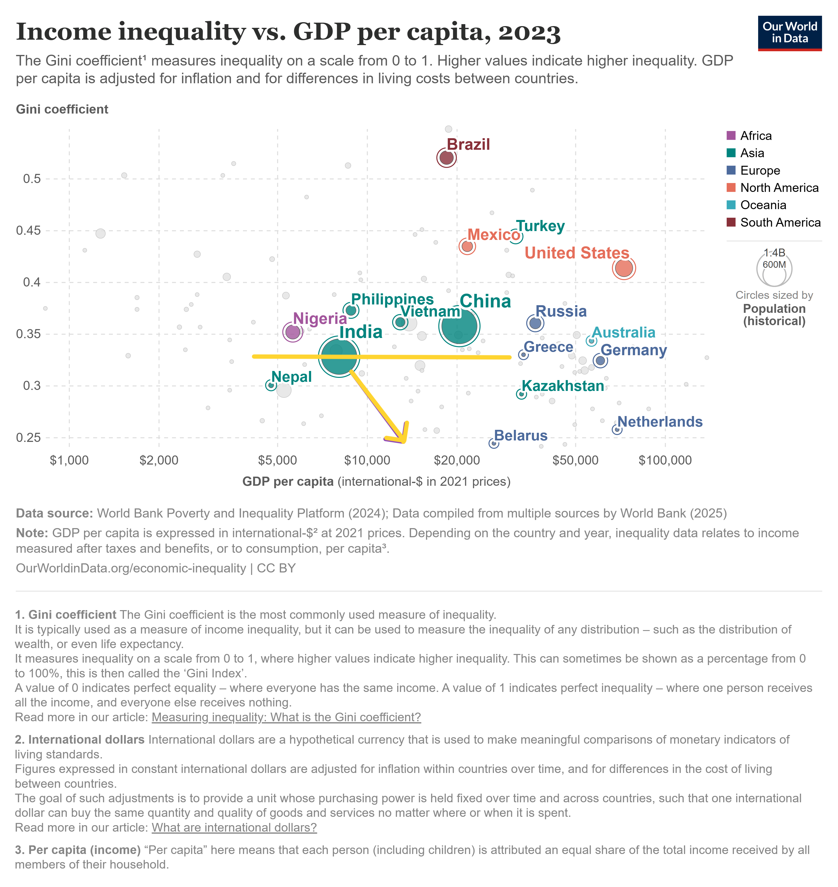

# The 2014P_Sāmatvārtha Thesisbox: An Invitation to Co-Create

"Sāmatva" (balance/resonance) + "Artha" (purpose/prosperity). 

The central thesis of Sāmatvārtha is that India's most pressing challenges—from the skills-experience gap and capital misalignment to land degradation and governance inertia—are fundamentally coordination & abstraction problems. These can be solved by rebalancing the roles & relationships between the Household, Commons, Market, and State. 

**Sāmatvārtha** is a complete socio-economic-ecological framework for informing public policy and private sector activity. Think of it as an indic equivalent to Doughnut economics (an inspiration!) which goes beyond publi cpolicy proposals into specific private sector venture (more like value chain) bets as well. 

2014P_ aims to be the steward for the initial Network State which will sprout the seeds of this philosophical vision. Think of it as a Think Tank + Venture Lab + Investment Studio. The levers it aims to work upon are business (to reshape value chains), technology (as commons), content (for memetics & standards), and compliance (for smooth change management.) 

---
### Our Core Mission: Charting a New Course for Indian Prosperity

India stands at a crossroads, defined by the tension between economic growth and deepening inequality. Coincidently, the moment is ripe for massive change with various converging inflections—AI, decentralization, climate change, and a digital-era monetary reset—that can either exacerbate this divide or be harnessed to forge a new path.

Our mission is to intentionally steer India's trajectory towards a more regenerative, federated, local-first, open, interoperable, self-enterprising, formal, inclusive future - one that serves its people and the planet, not just abstract economic indicators like GDP. 

The Indian Civilizational State is capable of far more than chasing a false sense of progress defined by colonial and imperial paradigms which still finds great solace in the hearts & mind supposed changemakers & administrators - we need to move on, despite the republic. What truly matters is how we navigate the journey down this yellow arrow (of decreasing Gini's coefficient in a positive-sum game), building prosperity without compromising our ecological and social ideals. 

This thesisbox is our answer to the question: *How?* We ultimately aim to have a set of independent yet connected **techno-legal-operational commons** (AI+Interchain+DPI) across various socio-economic primitives that will empower individuals and communities to make that happen.

We are not building a unicorn. We are cultivating a **federated forest** of regenerative MSMEs that will create unicorn economies in their circle of influence and locality. It's venture scale mindset (and risk hedging) applied to impact sector & value chains for a Cambrian explosion in scale post prototype PMFs are achieved. Tag along as we build Samatvartha equivalent of `India Stack x Cosmos Interchain × Network State`.

> [!NOTE]
> Draft Under Progress | Version v0.3.7 | [Network State Dashboard Pre-listing](https://thenetworkstate.com/dashboard/p/samatvartha)

---

### The Sāmatvārtha Ecosystem: A 3-D Engine

To make this real, we operate on three interconnected planes. Think of them as the Physics, the Tools, and the Players of this new game.

1.  **The Stack – *The Physics of a New Reality.***  
    This is the policy layer. A suite of first-principles proposals designed to bend the rules of the existing system towards regeneration. It is our interface with the State. Inspired from [India Stack](https://indiastack.org/).

2.  **The Interchain – *The Tools for a New Game.***  
    This is the technology layer. An open, interoperable network of ventures, protocols, and platforms that form the engine of the regenerative economy. It is the infrastructure for the techno-legal-operational commons. Inspired from [Cosmos](https://cosmos.network/) [Interchain](https://interchain.io/).

3.  **The Network State – *The Players on the Board.***  
    This is the community layer. A decentralized network of **Sutradhaars**—the thousand individuals, institutions, and initiatives who will use the tools to play the game and build this new world. It is the reinvigoration of the Household. Inspired from the [Network State](https://thenetworkstate.com/the-network-state-in-one-sentence).

---
### The Catalyst: The Role of 2014P_

A game needs a first move. **2014P_ is the integrated Think Tank & Venture Lab** acting as that catalyst. Our role is not to be the sole player, but to set up the board, design the initial pieces, and invite others to play. We:
*   Help shape the the Rules via the Think Tank arm
*   Forge the tools via the Venture Lab arm (a mix of Venture Incubator and Venture Studio)
*   Scale the impact federally via the Investment Studio arm

### The AdVenture Portfolio: Architecting the Regenerative Economy

The Interchain is composed of several "AdVentures," tangible business and social models designed to solve problems at the primitive level. The following table provides a snapshot of our current portfolio.

| Primitive / Domain | AdVenture(s) | Core Function & Problem Solved |
| :--- | :--- | :--- |
| **0. Foundational Architecture** | **FEOS Toolkit** | Provides standardized, scalable legal and operational structures (LLPs, Federations) to help enterprises navigate India's "compliance cliff-edges," enabling collaborative growth. |
| **1. Labour** | **Intercamp** | A "Learning by Doing" ecosystem that connects learners with real-world projects, bounties, and fellowships. It acts as an asynchronous, continuous alternative to traditional internships to solve the skills-experience gap. |
| **2. Education & Enterprising** | **Anvi Kriti** | An open education framework using recognized credentials (NIOS/IGNOU) integrated with Intercamp for practical experience. It counters rote learning by empowering a federated network of micro-schools and unschooling pods. |
| **3. Capital** | **KYRM** | **Community Banking:** A DPI to formalize social trust ("Saakh") as a credit underwriting layer, revitalizing P2P lending and UCBs.   **Realty:** Market infrastructure for fractional ownership of real-world assets, starting with "SM-REIT Ready" real estate. |
| **4. Production, Land, Energy** | **Forrest Farms & Jaivik Setu**| An integrated model for regenerative agriculture. It uses modular agri-ventures and catalytic infrastructure (like CBG plants) to make ecological restoration economically superior to degenerative practices. |
| **5. Consumption & Commerce**| **KiranaCulture & RamRamSa** | **KiranaCulture:** A federated quick-commerce backbone empowering local entrepreneurs to run fulfillment nodes for D2C brands.   **RamRamSa:** An Indic wellness and lifestyle platform built on a community-first, trust-led model. |
| **7. Civil Administration** | **Despite The Republic** | A "Civic Intelligence Network" designed to augment state capacity by channeling private-sector expertise and crowdsourced data into policy formulation and implementation, bypassing systemic inertia. |
*(Note: More modules are in development within the 2014P_ Venture Lab and Think Tank.)*

#### Ecosystem Synergies: A Flywheel of Orthogonal Cuts
The true power of this model lies in the symbiotic relationships between its components. While each AdVenture can function independently, their integration creates compounding network effects that can challenge incumbent, extractive systems—slaying leviathans by a thousand orthogonal cuts.

-   **Structural Backbone:** The **FEOS Toolkit** provides the legal architecture for an entrepreneur to compliantly structure their `Forrest Farms` agri-pod or `KiranaCulture` node as a lean LLP, abstracting away the complexity of India's compliance cliffs.
-   **Talent & Learning Engine:** **Anvi Kriti** provides motivated learners, and **Intercamp** provides the platform for them to gain "proof-of-experience" by working on real quests—building a financial model for **KYRM Realty**, a tech module for **KiranaCulture**, or a policy brief for **Despite The Republic**.
-   **Capital & Asset Layer:** **KYRM Community Banking** provides trust-based growth capital for entrepreneurs in **Forrest Farms**, while **KYRM Realty** allows for the fractional ownership of the physical assets they operate.
-   **Physical & Digital Commerce Loop:** **Forrest Farms** produces regenerative goods, **RamRamSa** builds the D2C brands around them, and **KiranaCulture** provides the federated fulfillment network to deliver them.
-   **The "Federated Franchise" Meta-Pattern:** This is our core scaling strategy. **Anvi Kriti** (micro-schools), **Forrest Farms** (agri-ventures), and **KiranaCulture** (fulfillment nodes) all follow the same model: provide a central playbook and shared tech commons to empower a decentralized network of entrepreneurs.

This integrated, fractal architecture is designed for emergent, resilient, and scalable growth.

> [!TIP]
> This shift won’t be proactively chased by the republic. It’ll have to happen *despite* it, bypassing entrenched, rotten incentives. It will require unlearning old assumptions and will feel messy. But unless we break from the old script, capital concentration will deepen, ecosystems will collapse, and we’ll still be chasing false progress.

---

### How You Can Participate: A Menu of Collaboration

We are actively seeking partners to accelerate this mission. This is an opportunity to move beyond incremental change and help architect a new economic substrate for India. Here are concrete ways to join us:

*   **For Builders, Doers, and Entrepreneurs:**
    *   **Launch a Federated Business:** Use our open-source playbooks to start a local, regenerative enterprise (e.g., a KiranaCulture node, an Anvi Kriti pod).
    *   **Join a Core Team:** Bring your operational, technical, or marketing expertise to help build out a core AdVenture at the Venture Lab level.
    *   **Contribute to the Commons:** As a domain expert, lend your skills to develop the shared DPIs, legal templates, or tech modules that will empower the entire network. We are pioneering novel employee-ownership models ('venture labour') for core contributors.

*   **For Funders, Foundations, and Investors:**
    *   **Provide Catalytic Capital:** Deploy flexible funding (venture capital, angel debt) to help the initial AdVentures prove their models and achieve product-market fit.
    *   **Enable the Commons with Grants:** Support the non-profit development of the open-source DPIs, educational materials, and shared infrastructure that forms the ecosystem's backbone.
    *   **Offer Working Capital & Credit:** Provide credit lines and tailored financial products for the network of federated micro-entrepreneurs as they launch and scale.

*   **For Institutions, NGOs, and Corporates:**
    *   **Form a Strategic Partnership:** Collaborate with our Think Tank on policy research or with the Venture Lab to pilot solutions within your ecosystem.
    *   **Become a Distribution Channel:** Help us onboard your network of MSMEs, students, or community members into the Sāmatvārtha ecosystem.

> [!TIP]
>Do explore how you can join this network state as a mentor, an entrepreneur,  an angel, a contributor - or simply put, a **Sutradhaar** - in shaping this thesis and its rollout.

##### How to Get Involved (To Be Updated):
This repository is the central nervous system of our work.

- **Explore the AdVenture Memos:** Dive into the specific venture proposals in the folders above. Understand the models and identify where your skills or interests align.
- **Engage on GitHub:** Use 'Issues' to ask questions, offer suggestions, or discuss specific aspects of a venture. This is the best way to start a conversation.
- **Connect with the Core Team:** For more direct partnership inquiries, follow the contact information provided on our website (coming soon).

---

# Building Bharat's Regenerative Future 🌱

> Catalyzing Conscious Capitalism through Business, Technology, Content & Compliance.

**2014P_ is forging a coalition for our shared regenerative future.** We are developing an ecosystem that connects talent, capital, technology, and businesses to cultivate a more conscious form of capitalism. Envision us as a Venture Lab fostering innovation, a Think Tank shaping policy, and a catalyst building federated commons and digital public infrastructures (DPIs) through a network of interconnected initiatives.

Our mission is to accelerate the development of local, federated, and circular value chains. We aim to fundamentally realign economic incentives with the well-being of people and the planet, prioritizing public benefit. Anchored in the socio-ecological wisdom of the Indus Valley, we seek sustainable alternatives to prevailing paradigms—be it hyper-consumerism or the vestiges of outdated socialist models—thereby aiming to reshape our relationship with wealth, work, and lifestyle.

This endeavor demands hands-on engagement at the dynamic intersection of new venture creation, strategic execution, and rapid adaptation. The **2014P_ Venture Lab** actively builds or supports companies, codifies learnings into repeatable playbooks, collaborates on policy frameworks for systemic change, and cultivates community spaces for this collective work.

> Whether you're an MSME, NGO, first-time entrepreneur, or seasoned operator, our Venture Lab offers support to establish, scale, and optimize regenerative businesses. Concurrently, our Think Tank works to ensure regulatory environments adapt to foster this vital transition.

### The Opportunity is Now 🚨

We are witnessing fundamental shifts. A convergence of disruptive forces—global and local inflections across society, technology, and regulation—is creating a unique window of unprecedented change and leverage. This volatility unlocks the potential for systems-level transformation and the emergence of new market paradigms.

Consider these simultaneous trends: the surge and financialization of Indian wealth, AI reshaping labor, decentralized systems altering ownership structures, the dawn of a digital-era monetary reset, the rise of techno-legal DPIs (like India Stack, a model for shared digital rails), and the worsening climate and geopolitical crises demanding urgent action.

We stand at a critical threshold. We can passively allow these forces to amplify existing inequalities and ecological damage, or we can actively shape a future defined by a regenerative relationship between human prosperity and planetary health. Moving from urgency to action requires clear philosophical grounding and practical execution.

> "... Full stack engineering begins with philosophy and ends with assembly." - @gfodor (Apr 27, 2023)

---

### Sāmatvārtha: Our Guiding Framework for Regenerative Prosperity ♾️

**Sāmatvārtha (सामत्वार्थ)** emerges where Sāmatva (balance, equilibrium, resonance) meets Artha (purpose, meaning, prosperity). Our words shape our world; our language encodes our philosophy. Sāmatvārtha serves as the guiding principle for all our cohesive efforts, from policy design to business model implementation.

It advocates for harmonious wealth creation, conscious consumption, regenerative ecologies, and embedded circular economies. It offers a vision where profit aligns with purpose and innovation serves impact—a grounded path for the Indus Valley and beyond.

> Sāmatvārtha is our core—the _bindu_ (central point) of this mandala—informing everything from policy solutions to business models. It is an integrated socio-economic framework for building regenerative prosperity, offering a clear, orthogonal alternative to the limited, often destructive, narratives of conventional economics and business.

We see this operating across three interconnected planes, or **substrates**:

1. **Ecological Substrate:** The health and capacity of natural systems and commons (akin to Doughnut Economics or bio-regional thinking); our debt to the elements (bhūta ṛṇa).
    
2. **Economic Substrate:** The interplay of markets, the state, commons, and households (partially modeled in the embedded economics model), with individuals at its center.
    
3. **Social Substrate:** The structures, well-being, and relationships within communities; our debt to society (nṛ ṛṇa).
    

The primary **levers** influencing these substrates are:

- **Narrative & Communication:** Shaping understanding and intent of popular memetics, as explored by thinkers like Jacques Ellul in [**Propaganda**](https://www.youtube.com/watch?v=UrXdidwsGOo&list=PLYwzb2-23bSYaLyNHNSzmXWO6CZh2413W&index=6).
    
- **Technology:** The tools and systems we build, applied consciously to avoid the pitfalls of "[**Technopoly**](https://www.youtube.com/watch?v=slGXGa4pt34&list=PLYwzb2-23bSYaLyNHNSzmXWO6CZh2413W&index=5)" described by Neil Postman.
    

Our "total factor productivity" in the economic substrate is shaped by these forces. The crucial question is: what future should this productivity serve?

Recent centuries have witnessed an oscillating power grab by the 'State' and 'Market' from the vital roles of the 'Household' and the 'Commons,' often with little regard for social or ecological wisdom (what NNT would call Lindy). This constant desire of outsourcing any human experience to either the State or the Markets has now become pathological, a predictable outcome of worldview that is afraid of [being different](https://beingdifferentbook.com/), and [selfish](https://www.brhat.in/dhiti/dharmikagene) by default - or even their proxies, whatever capito-marxo-'ism' you want to call them - that contemplate "man's dominion" over nature. We aim for something better than the legacy of such ideologies, regardless of their label. 

Recognizing this interconnectedness is vital. New technologies and narratives reshape culture, which in turn defines economic priorities and determines whether we regenerate, sustain, degenerate, or destroy natural and social capital—often hidden behind the false dichotomy of 'growth' versus 'development.'

Within any economic system, we can identify four intersecting tiers, or **"Four Parallel Circular Economies."** Understanding these is key to an intentional, holistic transition:

1. **Regenerative:** Most local circularity. Actively restores ecosystems and communities (e.g., agroforestry, community energy, local education and enterprise).
    
2. **Sustainable:** Federated circularity. Maintains ecological and social balance without significant negative externalities (e.g., natural farming, the 3Rs, ethical finance).
    
3. **Degenerative:** Beyond human-lifespan circularity. Depletes resources or harms the social fabric, causing near-permanent damage (e.g., most current industrial and corporate practices).
    
4. **Destructive:** Permanent destruction, no circularity. Causes severe, often irreversible damage (e.g., fossil fuels, deforestation, biosphere extinction, exploitative labor).
    

> Our focus is on reclaiming balance—the resonance, the [Ṛta](https://www.google.com/url?sa=E&q=https%3A%2F%2Fwww.brhat.in%2Frta) (cosmic order and truth)—within our socio-ecological systems, particularly the relationship between households, communities, and the commons (ecological and economic). This isn't a rejection of markets or the state, but a call to rebalance their roles, shifting functions towards federated, regenerative commons wherever appropriate. We aim to avoid perpetuating colonial and imperial errors, striving for an intentional shift to a shared regenerative future. This absolute clarity is paramount.

Sāmatvārtha is our evolving blueprint—or perhaps [seeds](https://www.google.com/url?sa=E&q=https%3A%2F%2Fwww.r3-0.org%2Fseeds-series%2F)—for intentionally shifting human activity towards the regenerative tiers. It involves pursuing policies and building ventures where profit motives drive this transition, rather than exacerbating problems. It leverages technology, first-principles thinking, fractal reasoning, and market mechanisms while respecting the complexity of adaptive (eco)systems. It prefers simple, effective heuristics over rigid micro-management or overly centralized transformations. It shall be India's grounded answer to building a truly sustainable and equitable future in the 21st century.

---

### The Sāmatvārtha Stack & The Sāmatvārtha Interchain 🌐

> Towards a Network State of Digital Public Infrastructure for the Regenerative Economy

To put Sāmatvārtha into practice, we employ a multi-pronged strategy, hedged across the cross-pollinating levers established in our model:

- **Disintermediating Markets (BUSINESS):** Showcasing role-model businesses and value chains that are regenerative by design.
    
- **Harnessing Technopoly (TECHNOLOGY for Commons):** Leveraging cutting-edge tools, first-principles thinking, and price/market mechanisms for public benefit.
    
- **Channeling Propaganda (CONTENT for Households):** Creating simple, effective heuristics (memetics) for collective internalization of regenerative practices.
    
- **Reforming Governance (COMPLIANCE):** Drawing insights from India's rich history of socio-ecological systems to inform modern economic policy design, moving away from colonial impositions.
    

We are methodically constructing the foundational **primitives**—composable, interoperable, open mechanisms including protocols, platforms, playbooks, and policy proposals—to enable this transformation. This digital public infrastructure (DPI) network will:

- Democratize access to capital for regenerative investments.
    
- Enable knowledge commons for shared practices and technologies.
    
- Foster federated, localized production and value creation.
    
- Facilitate conscious consumption by connecting mindful consumers with regenerative producers.
    
- Embed governance innovation through new models for decision-making and policy coordination.
    
- And much more.
    

> We don't need every vector to succeed immediately; the success of any one can catalyze the proliferation of others. This is venture capital's power law strategy applied to systemic transformation. Specific action plans for each strategic module—and how you can contribute—are detailed throughout our documentation.

Inspired by various polycentric governance models, past and present (like [Cosmos](https://www.youtube.com/watch?v=Luh7m7YHRts) with Interchain, [India Stack](https://www.youtube.com/watch?v=jebr7CQcKGI) with DPIs, Balaji Srinivasan with [Network State Concept](https://thenetworkstate.com/dashboard)), we are developing three interconnected components to operationalize this vision:

1. **The Sāmatvārtha Stack:** A suite of techno-legal public policy proposals and change management strategies, akin to India Stack, designed to be the panacea India needs. This is the interface for national and state governments.
    
2. **The Sāmatvārtha Interchain:** A network of DPI-native commons—open, composable, interoperable, and fractally sovereign tools, platforms, protocols, shared playbooks, and data layers. It focuses on empowering the private sector and households to proliferate regenerative businesses.
    
3. **The Sāmatvārtha Network State:** A digitally-native community of changemakers, builders, and users of the Stack and Interchain, distributing value creation across its constituents. This is the engine of activity, fueled by Sutradhaars—individuals, institutions, and initiatives.
    

> The Sutradhaars of the Network State will use Interchain tools to collaborate, build ventures, and ignite a Cambrian explosion of regenerative value creation. They will also drive the advocacy for and adoption of the Sāmatvārtha Stack, advancing India's (or any willing nation's) transition to a regenerative economy.

##### Sahastra Samatvartha Sutradhaar
Just as India Stack required dedicated "[Sutradhaars](https://www.linkedin.com/posts/ispirt_india-stack-explained-uidai-chairperson-activity-7175753853286440960-r6t3/)"(key orchestrators/narrators) to bring its techno-legal DPI vision to life, Sāmatvārtha will too. We aim to initially build a network state of **1,000 individuals, institutions, or initiatives** aligned with this grand vision. These Sutradhaars will act as catalysts, rapidly contributing to building and promoting the Sāmatvārtha Stack & Interchain, thereby paving the way for a much larger network as they, in turn, inspire and onboard their own nested efforts and 1000s of contributors, and so on! That's the ambition. You can call it an ecosystem, a community, a [network state](https://thenetworkstate.com/the-network-state-in-one-sentence), a [fractal mandala](https://www.brhat.in/mandala), or even a banyan tree — ultimately, it's about alignment, collaboration, and exponential progress towards a regenerative future.

---

### The 2014P_ Approach: Composable Ventures, Investments & Policy Ecosystem🎬

2014P_ is an integrated Venture Lab, Investment Studio, and Think Tank. Our purpose is to architect and accelerate India's transition to Samatvartha - i.e. towards a more regenerative, federated, local-first economy. 

Our work across all pillars is executed through four fundamental levers: **Business** (new models), **Technology** (DPIs & commons), **Content** (narrative change), and **Compliance** (policy & governance design). In practice, it's a community of dreamers, builders, angels and changemakers forming an execution-focused ecosystem.  

All our venture blueprints and frameworks—protocols, platforms, playbooks, and policy proposals—will be eventually open and public, reflecting our belief in a future of federated commons, not gated empires. However, to build together—to transform ideas into living enterprises and scaled impact—we will host a working community of entrepreneurs/proprietors, operators/learners and investors/lenders. This is where we _co-create_, _experiment_, _fund_, _franchise_, and _scale_ real-world models together collaboratively.  

##### The Venture Lab: The Engine of Regenerative Enterprise

The Lab is where new regenerative business models are designed, built, and perfected. It focuses on creating robust, replicable archetypes for a new economy.

- **Strategic Advisory & Consulting:** We engage in deep partnerships with existing MSMEs, NGOs, and corporations to embed regenerative principles and Samatvartha thinking into their core strategy and operations. This is about transforming existing entities, not just building new ones.
    
- **New Venture Incubation & Acceleration:** We actively co-create, build, and scale new businesses from the ground up. We provide a genuine alternative to traditional VC paths for first-time founders, professionals in their second innings, and family businesses, focusing on sustainable growth and mission alignment.
    
- **Capability Enhancement & Fractional Expertise:** We provide hands-on support by deploying our expert teams to serve as fractional leaders (e.g., COO, CTO, Head of Marketing) or as a targeted agency for technology development, AI integration, digital marketing, process automation, and compliance navigation.
    
- **Government Scheme Liaising & Execution:** We build accessible mechanisms, fellowships, and operational frameworks to help entrepreneurs effectively leverage government schemes (like PMEGP, AIF). We bridge the gap between policy intent and on-the-ground private capacity.
    
- **Federated Franchise Playbooks:** The ultimate codification of the Lab's work. We distill a successful venture's entire operational logic into an exhaustive, open-source "business-in-a-box" playbook, designed to empower a federated network of entrepreneurs to replicate success with low friction.
    

##### The Investment Studio: The Capital Architecture Arm

The Studio designs and structures the financial vehicles and strategies necessary for the regenerative economy to thrive. It architects how capital behaves to serve the mission.

- **Capital Strategy & Mission-Aligned Structuring:** We design bespoke capital stacks for regenerative ventures. This moves beyond standard equity/debt to include blended finance, revenue-sharing agreements, patient debt, and other instruments that align investor returns with long-term, sustainable impact.
    
- **Regenerative M&A and Ecosystem Consolidation:** We advise on and facilitate strategic mergers and acquisitions between mission-aligned enterprises. The goal is to build ecosystem resilience, create shared infrastructure, and achieve synergistic scale—the opposite of extractive corporate roll-ups.
    
- **Design of Novel Financial Instruments:** We architect new, investable asset classes intrinsically linked to regenerative outcomes. From apt green/blue credits to novel 'venture labour' employee ownership models - it's financial novation only where necessary, as too much derivation can also cause problems due to distance of incentives. 
    
- **Investment Readiness & Due Diligence Support:** We work with regenerative enterprises to prepare them for investment, and with impact investors to conduct deep due diligence that assesses not just financial returns but true ecological and social impact.
    

#### The Think Tank: The Engine of Systemic Leverage

The Think Tank is our instrument for re-architecting the "rules of the game." It operates from first principles to design and advocate for a more enabling systemic environment.

- **First-Principles Policy Architecture:** We do not merely react to existing policy; we design new systems from the ground up. This involves deep research and modeling to propose new, elegant, and effective policy frameworks that can leapfrog existing paradigms.
    
- **Fractional Advisory to Leadership:** We provide confidential, non-partisan, and deeply researched strategic counsel to key decision-makers—policymakers, politicians, and senior bureaucrats. Our role is to augment state capacity with sharp, independent, and actionable systems thinking.
    
- **Governance Design for Digital Public Infrastructure (DPIs):** We architect the open, interoperable, and resilient governance models for the DPIs that will underpin the regenerative economy. This work ensures new public tech is built for public good, trust, and long-term sustainability.
    
- **Public Narrative & Coalitions:** We create the content and build the coalitions necessary to create social consensus around critical policy shifts, ensuring that systemic change has broad-based understanding and support.

> [!TIP] 
> 1,000 Sutradhaars. 10,000 Entrepreneurs. The True "Unicorn" Network.
> 
> While we don't fixate on valuation metrics, let's translate our impact goal into the language of the current zeitgeist. Consider 10,000 regenerative entrepreneurs, each earning ₹12 Lakhs per year in tax-free income from their sole proprietorships. With a conservative ~8x PE multiple, this network achieves a collective "valuation" of ₹10,000 Crore. This is our interpretation of the "one-person unicorn" hypothesis that many venture capitalists in silicon valley are touting in a 'Post-AI' world. Not one individual concentrating immense economic surplus, which perpetuates past mistakes, but a federated network of empowered individuals creating distributed prosperity.
> 
> **This is what India needs to ensure its demographic dividend becomes a blessing, not a burden.**

### Seeding Sāmatvārtha: From Philosophy to a Portfolio of Catalytic Action 🪴

The preceding sections laid the necessary philosophical grounding, setting the stage for fractal innovation. Our approach involves developing initiatives across foundational economic **primitives** (such as Capital, Labour, Production, Consumption, Education, Administration, Software, Hardware). These initiatives address specific needs and evolve through a structured lifecycle, from initial concepts to scalable franchises, and ultimately to open, composable, interoperable, and fractally sovereign public goods. This is the culmination of a decade of exploration and a couple of years of rigorous questioning of norms.

Our initiatives will evolve through this lifecycle:

- **Thesis Modules:** Foundational business models addressing entangled primitives.
    
- **Distribution & GTM Experiments:** Rapid prototyping and hypothesis testing of various products for target distribution channels.
    
- **Franchises & Micro-Enterprises:** Codification into replicable, scalable playbooks for federated value creation and local circular economies.
    
- **Shared Regenerative Commons:** Transformation into open digital public infrastructure, enabling plug-and-play implementation capabilities. We welcome free riders, as widespread adoption benefits all.
    

> Practically, this begins with 2014P_ seeding the **'Sāmatvārtha Thesisbox'** and kickstarting the alpha builds for various GTM/PLG MVPs across primitive modules. These initial private experiments will evolve to support fractally sovereign franchises and proprietors via the open commons and DPIs of the Interchain. You will find more clarity on these as you explore their specific modules.

Our strategy is to build a federated ecosystem by launching and supporting a portfolio of interconnected ventures. Below is a summary of the core concepts within the Samatvartha Thesisbox, followed by a menu of specific, actionable go-to-market (GTM) experiments that can be selected and funded to kickstart the entire flywheel.

##### **I. The Samatvartha Venture Portfolio: A Briefing**

This is a snapshot of the core ventures we aim to build and federate.

- **Intercamp & Anvi Kriti (Labour & Education):**
    
    - **What it is:** An open ecosystem for "Learning by Doing." Anvi Kriti provides credentialed (NIOS/IGNOU) alternative education pathways, while Intercamp provides the platform for real-world project experience (practicums, bounties, fellowships).
        
    - **Core Thesis:** By unbundling credentialing from learning and connecting it to tangible work, we can solve India's skills-experience gap and create a new generation of capable, enterprising individuals.
        
- **Forrest Farms & Jaivik Setu (Land & Production):**
    
    - **What it is:** An integrated model for regenerative agriculture and real estate. It combines modular agri-ventures run by local entrepreneurs with catalytic infrastructure (like CBG plants) to make ecological restoration economically superior.
        
    - **Core Thesis:** Regenerative land use is not a cost but a high-yield investment strategy that creates diverse, resilient revenue streams while rebuilding natural capital.
        
- **KYRM (Capital & Realty):**
    
    - **What it is:** A suite of market infrastructure for alternative finance. It includes a protocol for trust-based community banking (P2P + UCB) and a platform for fractional ownership of real-world assets, starting with SM-REIT-ready real estate.
        
    - **Core Thesis:** By formalizing social trust ("Saakh") and creating liquid markets for alternative assets, we can unlock immense community capital and build a more resilient, decentralized financial system.
        
- **KiranaCulture (Commerce & Trade):**
    
    - **What it is:** A federated, asset-light quick commerce backbone. It empowers local Kiranas and entrepreneurs to become hyper-efficient fulfillment nodes for D2C brands, offering a community-owned alternative to centralized dark store models.
        
    - **Core Thesis:** Modern logistics can be democratized. By providing shared tech infrastructure, local entrepreneurs can outperform centralized models on both capital efficiency and community value.
        
- **RamRamSa (Consumption & Lifestyle):**
    
    - **What it is:** A platform for Indic wellness, starting with content and community around health, fitness, and nutrition.
        
    - **Core Thesis:** A trust-first, community-up approach is a more sustainable and capital-efficient way to build authentic consumer brands than the traditional "product-first, market-later" model.
        
- **Despite The Republic (Civil Administration):**
    
    - **What it is:** A civic intelligence network that uses private sector expertise and crowdsourced data to enhance public state capacity and enable evidence-based policy reform.
        
    - **Core Thesis:** The biggest friction in governance is a coordination and information problem. By creating structured channels for intelligence to flow, we can augment state capacity without subverting it.
        

##### **II. Go-To-Market Pathways: Selectable Starting Points**

We have designed several distinct, fundable GTM experiments. An initial grant or partnership can activate one or more of these pathways, each designed to catalyze the broader ecosystem.

1. **GTM Pathway A: The Network Weaver (The Strategic Entry Point)**
    
    - **The Experiment:** Develop and launch a simple, high-value **Micro-SaaS for digital communities**. Its core function is a "member use-case catalogue"—a tool allowing community managers to easily map and discover their members' skills, needs, and offerings.
        
    - **The Strategy:** This is our strategic wedge. It solves an immediate, painful problem for hundreds of existing online communities (influencers, professional groups, alumni networks). By offering this tool, we:
        
        1. **Build a Funnel:** It becomes the primary on-ramp for individuals and institutions to join the Samatvartha Network State.
            
        2. **Generate Data:** It allows us to map the landscape of aligned talent and needs.
            
        3. **Bootstrap Intercamp:** The feature set of this tool can evolve directly into the core discovery engine of the Intercamp platform.
            
    - **The Ask:** A lean grant to fund the MVP development and initial rollout of this catalyst tool. This is the lowest-cost, highest-leverage way to begin building the network.
        
2. **GTM Pathway B: The Regenerative Land Accelerator**
    
    - **The Experiment:** Fund the first **Forrest Farms pilot**. This involves creating the open-source **PMEGP-aligned playbooks** for modular agri-ventures and partially funding the setup of a catalytic **CBG plant** in partnership with a landowner.
        
    - **The Strategy:** This provides a powerful, visual proof-of-concept for our regenerative economic model. The playbooks become a public good that any aspiring agri-preneur can use, creating a scalable impact far beyond the pilot site.
        
    - **The Ask:** A more substantial grant focused on creating tangible, on-the-ground infrastructure and open-source intellectual property.
        
3. **GTM Pathway C: The Campus Catalyst Program**
    
    - **The Experiment:** Formalize a "GSoC-style" program via **Intercamp** to partner with university fraternities and public policy clubs (like the existing BITS Pilani collaboration).
        
    - **The Strategy:** We can outsource specific R&D "quests" from our venture portfolio (e.g., "Map the regulatory hurdles for UCBs," "Build a financial model for a KiranaCulture node") to motivated student teams in exchange for "proof-of-experience" and mentorship.
        
    - **The Ask:** A small operational grant to manage the program, provide stipends, and build the digital infrastructure on Intercamp to track these collaborative projects. This is a highly efficient way to advance our R&D while nurturing future talent.
- (Placeholder: Summary table or headers for various (ad)ventures and links to their documentation will be inserted here. Examples from the provided diagram include Intercamp, KYRM, ForrestFarms/JaivikSetu, Despite The Republic, etc.)
    

---

### Join the Regenerative Revolution 🚀

The regenerative transformation of the Indian economy is not just possible—it's inevitable. The question is whether it will happen by design or by crisis. At 2014P_, we choose design, intention, and collective wisdom.

This is an invitation to co-create an economy that works for all life—one that honors our past while boldly embracing our future. One that recognizes that true wealth lies not in extraction but in cultivation; not in scarcity but in circulation; not in domination but in harmony.

Building this future requires collective action, a community "co-mutiny" for positive change! We invite you to:

- **Learn More:** Explore the Sāmatvārtha framework and our specific venture modules in greater detail on our website [Link Placeholder].
    
- **Join the Community:** Subscribe to our newsletter [Link Placeholder] for updates and insights. If you are an entrepreneur, operator, or investor aligned with this vision, consider joining the Sāmatvārtha Sutradhaar network [Link Placeholder].
    
- **Collaborate:** Reach out if you see opportunities for partnership on specific initiatives or wish to utilize our Venture Lab services [Link Placeholder].
    

> Consider the potential: A million proprietors, empowered by the Sāmatvārtha Stack & Interchain (built with the help of the initial Sutradhaars), generating sustainable livelihoods. This "federated unicorn" network of thriving micro-enterprises (achieving, for instance, ₹12 Lakhs in tax-free business income annually) creates a powerful, distributed economic engine—a stark contrast to the concentrated wealth models of traditional corporations. This is what is needed to truly unlock India's demographic dividend.

The future must be regenerative. The future must be federated. The future shall be Sāmatvārtha.  
Will you do your bit?

---
# Understanding Our Structure: A Modular Approach 🧩

To navigate this repository and our broader vision, consider the following hierarchy. This modular structure mirrors the constructs of Intercamp, a sub-module for coworking+community collaboration between individuals, institutions, and initiatives.

- **Initiatives:** Overarching strategic commitments (e.g., the Sāmatvārtha Network State, the Interchain, the Stack). Currently, these are unified within this ThesisBox repository.
    
- **Primitives:** Fundamental domains or core economic building blocks we aim to address (e.g., Capital, Labour, Production, Education).
    
- **Adventures:** Specific venture experiments or distinct projects designed to innovate within these primitives.
    
- **Quests:** Focused workstreams or pilot projects undertaken within an Adventure.
    
- **Bounties:** Clearly defined, outcome-driven deliverables or sub-projects that advance a Quest.

Before we dive deep into what Samatvartha Thesisbox is, below is an (indicative) illustration of various high-level components of it. You will discover specific proposals and action plan as you go through these sub-modules. (This is to be updated with latest thinking.)

---
